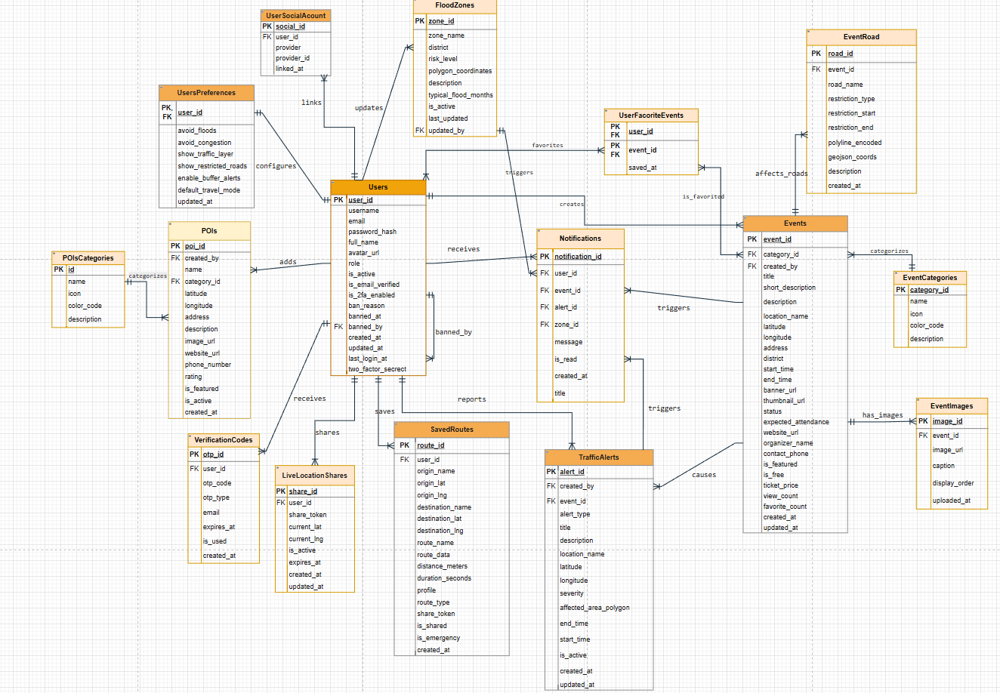
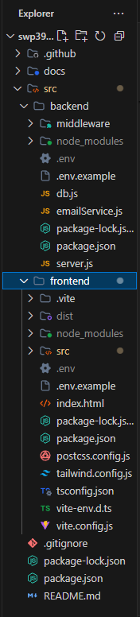
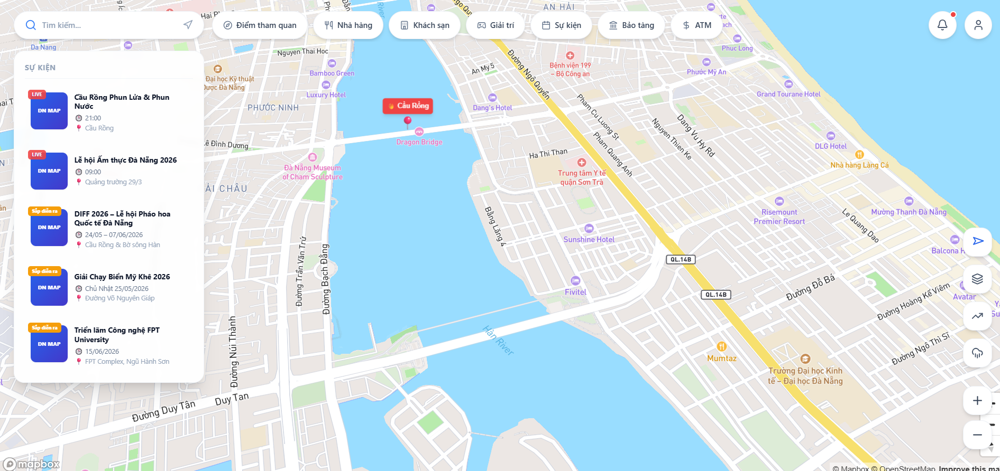

# AI Audit Log

## 1. Thông tin chung

| Thông tin | Nội dung |
|---|---|
| Môn học |Software Development Project  |
| Mã môn học |SWP391  |
| Lớp |SE20A04  |
| Học kỳ | 5 |
| Tên bài tập / Project |  |
| Tên sinh viên / Nhóm | Nguyen Huu Phuc |
| MSSV / Danh sách MSSV |DE190462  |
| Giảng viên hướng dẫn |Thầy QuangLTN |
| Ngày bắt đầu | 11/05/2026 |
| Ngày hoàn thành |  |

---

## 2. Công cụ AI đã sử dụng

Đánh dấu các công cụ AI đã sử dụng trong quá trình thực hiện bài tập/project.

- [✓] ChatGPT
- [✓] Gemini
- [✓] Claude
- [ ] GitHub Copilot
- [ ] Cursor
- [✓] Antigravity
- [ ] Perplexity
- [ ] Microsoft Copilot
- [ ] Công cụ khác: ....................................

---

## 3. Mục tiêu sử dụng AI

Mô tả ngắn gọn sinh viên/nhóm đã sử dụng AI để hỗ trợ những công việc nào.

Ví dụ:

- Phân tích yêu cầu bài toán
- Gợi ý ý tưởng giải pháp
- Thiết kế database
- Thiết kế giao diện
- Viết code mẫu
- Debug lỗi
- Tối ưu code
- Viết test case
- Kiểm tra bảo mật
- Viết báo cáo
- Chuẩn bị slide thuyết trình
- Tìm hiểu công nghệ mới

### Mô tả mục tiêu sử dụng AI

```text
 Em đã sử dụng AI để hỗ trợ trong các công việc hằng ngày của một sinh viên chuyên nhành kỹ thuật phần mềm đó là nhờ AI hỗ trợ đưa ra các công nghệ sử dụng cho dự án ,thiết kế giao diện sao cho thân thiện nhất , gợi ý thiết kế database , debug lỗi , tối ưu code, đưa ra ý tưởng cho các chức năng của dự án và hướng dẫn viết test case. Nhưng, AI chỉ đóng vai trò hỗ trợ tham khảo, việc phát triển và hoàn thiện sản phẩm vẫn do cá nhân thực hiện.

## 4. Nhật ký sử dụng AI chi tiết

> Mỗi lần sử dụng AI cho một phần quan trọng của bài tập/project, sinh viên cần ghi lại theo mẫu bên dưới.  
> Sinh viên/nhóm có thể nhân bản mẫu “Lần sử dụng AI” nhiều lần tùy theo số lần sử dụng AI thực tế.

---

### Lần sử dụng AI số 1

| Nội dung | Thông tin |
|---|---|
| Ngày sử dụng | 18/5/2026 |
| Công cụ AI | ChatGPT / Gemini / Claude |
| Mục đích sử dụng | Hỗ trợ phân tích và phát triển hệ thống bản đồ cảnh báo cho thành phố Đà Nẵng  |
| Phần việc liên quan | Requirement / Design / Database / Frontend   |
| Mức độ sử dụng |  Hỗ trợ nhiều |

#### 4.1. Prompt đã sử dụng

```text
Tôi muốn làm một dự án môn học về một map có cảnh báo ngập khi trời mưa, cảnh báo tắc đường, gợi ý đường đi tốt nhất, cảnh báo các tuyến đường tắc khi có sự kiện, nhưng mà đó chỉ là các tính năng cơ bản mục đích chính của dự án này đó là quảng bá các sự kiện của 1 thành phố (ví dụ thành phố đà nẵng của việt nam).
Yêu cầu:
Map data: MapBox.
Routing API: Directions API của MapBox.
Authentication: JWT đơn giản, sau này phát triển Google OAuth.
Chạy local.
Database: SQL Server Express.
- Hướng dẫn tạo các file code cho dự án map cảnh báo từ backend, frontend, database và tất cả các file liên quan để tạo ra map hoàn chỉnh nhất.
-Frontend sử dụng React, backend NodeJS + Express, database SQL Server.
-Hướng dẫn thiết kế database chi tiết cho dự án, nêu rõ các mối quan hệ giữa các bảng với nhau.
-gợi ý thiết kết UX/Ui của Map
```

#### 4.2. Kết quả AI gợi ý

Tóm tắt nội dung AI đã trả lời hoặc gợi ý.

```text
AI đã gợi ý kiến trúc tổng thể cho hệ thống map cảnh báo gồm frontend React, backend NodeJS/Express và SQL Server. AI hướng dẫn tổ chức thư mục dự án, xây dựng giao diện bản đồ, thiết kế database, tạo API backend, sửa lỗi giao diện và cải thiện UX/UI.
```

#### 4.3. Phần sinh viên/nhóm đã sử dụng từ AI

Mô tả rõ phần nào được sử dụng lại từ gợi ý của AI.

```text
Em đã tham khảo cấu trúc thư mục dự án, cách kết nối frontend với backend, thiết kế database, một số đoạn code mẫu React và NodeJS, cũng như ý tưởng thiết kế giao diện bản đồ cảnh báo để đề xuất nhóm.
```

#### 4.4. Phần sinh viên/nhóm tự chỉnh sửa hoặc cải tiến

Mô tả sinh viên/nhóm đã thay đổi, kiểm tra, sửa lỗi hoặc cải tiến gì so với gợi ý ban đầu của AI.

```text
Em đã chỉnh sửa lại lại một số layout ở phần giao diện để phù hợp với yêu cầu thực tế, tối ưu lại cấu trúc database là thêm một số bảng so với số bảng mà AI đã đưa ra , bổ sung chức năng riêng và kiểm tra lại code trước khi sử dụng trong dự án và trước khi push lên github.
```

#### 4.5. Minh chứng

| Loại minh chứng | Nội dung |
|---|---|
| Link commit | https://github.com/fptu-se-su26/swp391-su26-ai-audit-project-swp391_se20a04_group-01-1/tree/feature/de190462_update_MapBox_API |
| File liên quan ||
| Screenshot |            |
| Kết quả chạy/test |  |
| Link video demo |  |
| Ghi chú khác |  |


#### 4.6. Nhận xét cá nhân/nhóm

Sinh viên/nhóm học được gì sau lần sử dụng AI này?

```text
Em đã học được các bước để xây dựng hệ thống map fullstack bằng React, NodeJS và SQL Server, tổ chức cấu trúc dự án và cải thiện kỹ năng debug, thiết kế giao diện cũng như làm việc với Git/GitHub.
```

---

### Lần sử dụng AI số 2

| Nội dung | Thông tin |
|---|---|
| Ngày sử dụng | 15/06/2026 |
| Công cụ AI | Antigravity / Gemini |
| Mục đích sử dụng | Thiết kế và phát triển tính năng "Đồng bộ & Hiển thị Sự kiện Đô thị lên Bản đồ chính" và tích hợp chỉ đường |
| Phần việc liên quan | Database / Backend / Frontend |
| Mức độ sử dụng | Hỗ trợ nhiều |

#### 4.1. Prompt đã sử dụng

```text
Tôi muốn phát triển tính năng "Đồng bộ & Hiển thị Sự kiện Đô thị lên Bản đồ chính (Home.tsx)" cho dự án Đà Nẵng Pulse.
Các yêu cầu cụ thể:
1. Hiển thị Marker Sự kiện trên Mapbox Map bằng cách lấy danh sách từ API `/api/events` (chỉ các sự kiện đã được duyệt).
2. Xây dựng Side Panel/Popup hiển thị chi tiết sự kiện khi người dùng click vào marker (bao gồm tên sự kiện, thời gian diễn ra, banner, thông tin vé, mô tả).
3. Tích hợp Lưu/Yêu thích sự kiện đồng bộ với bảng junction `UserFavoriteEvents` trong cơ sở dữ liệu.
4. Lọc sự kiện theo từng tháng (tháng 1 đến 12), tìm kiếm sự kiện theo tên/địa điểm, và lọc theo category.
5. Sự kiện cần hiển thị theo 3 trạng thái:
   - Sắp diễn ra: marker bình thường theo màu danh mục.
   - Đang diễn ra: marker có viền nhấp nháy (pulsing ring) và badge nhấp nháy đỏ.
   - Đã kết thúc: marker và phần tử sidebar bị làm nhạt màu (opacity-50 grayscale).
6. Khi bấm "Chỉ đường đi tới đây" từ sự kiện, hãy hiển thị bảng Chi tiết lộ trình di chuyển (thời gian ước tính, số km, các phương tiện) ngay dưới mục Khám phá sự kiện và tự động co dãn chiều cao của sidebar sự kiện để không bị tràn màn hình.
```

#### 4.2. Kết quả AI gợi ý

```text
AI đã đề xuất giải pháp kỹ thuật chi tiết:
1. Backend: Cập nhật server.js, bổ sung các API lấy danh sách sự kiện (GET /api/events kèm left join EventCategories), API lấy danh mục (GET /api/event-categories), API phê duyệt/xóa cho Admin, và các API Toggle yêu thích (POST /api/events/:id/favorite).
2. Frontend Components:
   - EventsLayer.tsx: Component vẽ marker Mapbox động dựa trên trạng thái thời gian thực của sự kiện.
   - EventsSidebar.tsx: Sidebar trái chứa thanh tìm kiếm, bộ lọc tháng, bộ lọc danh mục và danh sách sự kiện.
   - EventDetailSidebar.tsx: Sidebar phải trượt ra hiển thị chi tiết sự kiện và nút yêu thích.
3. Giao diện: Thiết kế UI tích hợp bảng chỉ đường (routeData) ngay bên dưới EventsSidebar bằng cách truyền prop hasRoute để giảm chiều cao tối đa xuống max-h-[calc(100vh-390px)] kèm transition mượt mà.
```

#### 4.3. Phần sinh viên/nhóm đã sử dụng từ AI

```text
Em đã áp dụng các gợi ý của AI vào mã nguồn:
1. Triển khai 3 component: EventsLayer.tsx, EventsSidebar.tsx, và EventDetailSidebar.tsx theo đúng cấu trúc giao diện đề xuất.
2. Tích hợp các hàm gọi API trong `src/frontend/src/services/api.ts`.
3. Tích hợp logic vẽ đường đi và hiển thị bảng chỉ đường ở phía dưới sidebar sự kiện trong Home.tsx.
4. Sử dụng mã SQL tạo các danh mục sự kiện mẫu và 8 sự kiện Đà Nẵng để nạp vào cơ sở dữ liệu.
```

#### 4.4. Phần sinh viên/nhóm tự chỉnh sửa hoặc cải tiến

```text
Trong quá trình tích hợp, em đã tự phát hiện và sửa đổi các lỗi nghiêm trọng từ mã nguồn gợi ý ban đầu của AI để tương thích với cơ sở dữ liệu thực tế:
1. Sửa lỗi lệch cột (contact_phone): AI sinh code backend sử dụng cột contact_email trong khi bảng dữ liệu thực tế lại định nghĩa là contact_phone. Em đã cập nhật lại toàn bộ API POST và PUT để sử dụng chính xác contact_phone, tránh lỗi sập truy vấn database.
2. Sửa lỗi Check Constraint (CHK_Events_Status): File Database_DN_Pulse.sql ban đầu có check constraint giới hạn status trong ('draft', 'published', 'cancelled', 'ended'), gây lỗi xung đột khi code backend thêm sự kiện dạng 'pending' hoặc 'approved'. Em đã sửa đổi ràng buộc trong file SQL thành ('pending', 'approved', 'cancelled') và đổi mặc định sang 'pending'.
3. Viết file seed_events.sql chính thức và đồng bộ hóa các ID khóa ngoại (created_by = 1, category_id) giúp việc cài đặt database chạy trực tiếp bằng file SQL thành công 100%.
4. Thêm hiệu ứng transition-all duration-300 vào EventsSidebar để chuyển đổi mượt mà giữa trạng thái bình thường và trạng thái hiển thị chỉ đường.
```

#### 4.5. Minh chứng

| Loại minh chứng | Nội dung |
|---|---|
| Link commit | https://github.com/fptu-se-su26/swp391-su26-ai-audit-project-swp391_se20a04_group-01-1/commit/DE190462_events |
| File liên quan | [server.js](file:///d:/WorkSpace/SWP/swp391-su26-ai-audit-project-swp391_se20a04_group-01-1/src/backend/server.js), [seed_events.sql](file:///d:/WorkSpace/SWP/swp391-su26-ai-audit-project-swp391_se20a04_group-01-1/docs/Database/seed_events.sql), [Home.tsx](file:///d:/WorkSpace/SWP/swp391-su26-ai-audit-project-swp391_se20a04_group-01-1/src/frontend/src/pages/Home/Home.tsx), [EventsSidebar.tsx](file:///d:/WorkSpace/SWP/swp391-su26-ai-audit-project-swp391_se20a04_group-01-1/src/frontend/src/pages/Home/components/EventsSidebar.tsx) |
| Screenshot |  |
| Kết quả chạy/test | Đã chạy test SQL Server (Insert/Update/Delete thành công) và TypeScript biên dịch không lỗi (0 errors). |
| Link video demo | |
| Ghi chú khác | Tất cả các API yêu thích và duyệt sự kiện admin đã được kiểm nghiệm thực tế. |

#### 4.6. Nhận xét cá nhân/nhóm

```text
Qua đợt phát triển này, em đã học được kỹ năng xử lý xung đột ràng buộc dữ liệu (CHECK constraint) trong SQL Server, cách tối ưu hóa không gian hiển thị (UX/UI responsive) của ứng dụng bản đồ khi lồng ghép nhiều panel chức năng cùng một phía.
```

---

### Lần sử dụng AI số 3

| Nội dung | Thông tin |
|---|---|
| Ngày sử dụng |  |
| Công cụ AI | ChatGPT / Gemini / Claude / GitHub Copilot / Cursor / Antigravity / Khác |
| Mục đích sử dụng |  |
| Phần việc liên quan | Requirement / Design / Database / Frontend / Backend / Testing / Debug / Report / Presentation / Other |
| Mức độ sử dụng | Hỗ trợ ý tưởng / Hỗ trợ một phần / Hỗ trợ nhiều / Sinh chính nội dung |

#### 4.1. Prompt đã sử dụng

```text
Dán nguyên văn prompt đã hỏi AI tại đây.
```

#### 4.2. Kết quả AI gợi ý

```text
Viết tại đây...
```

#### 4.3. Phần sinh viên/nhóm đã sử dụng từ AI

```text
Viết tại đây...
```

#### 4.4. Phần sinh viên/nhóm tự chỉnh sửa hoặc cải tiến

```text
Viết tại đây...
```

#### 4.5. Minh chứng

| Loại minh chứng | Nội dung |
|---|---|
| Link commit |  |
| File liên quan |  |
| Screenshot |  |
| Kết quả chạy/test |  |
| Link video demo |  |
| Ghi chú khác |  |

#### 4.6. Nhận xét cá nhân/nhóm

```text
Viết tại đây...
```

---

## 5. Bảng tổng hợp mức độ sử dụng AI

Đánh dấu mức độ AI hỗ trợ ở từng hạng mục.

| Hạng mục | Không dùng AI | AI hỗ trợ ít | AI hỗ trợ nhiều | AI sinh chính | Ghi chú |
|---|:---:|:---:|:---:|:---:|---|
| Phân tích yêu cầu |  |  |  |  |  |
| Viết user story/use case |  |  |  |  |  |
| Thiết kế database |  |  |  |  |  |
| Thiết kế kiến trúc hệ thống |  |  |  |  |  |
| Thiết kế giao diện |  |  |  |  |  |
| Code frontend |  |  |  |  |  |
| Code backend |  |  |  |  |  |
| Debug lỗi |  |  |  |  |  |
| Viết test case |  |  |  |  |  |
| Kiểm thử sản phẩm |  |  |  |  |  |
| Tối ưu code |  |  |  |  |  |
| Viết báo cáo |  |  |  |  |  |
| Làm slide thuyết trình |  |  |  |  |  |

---

## 6. Các lỗi hoặc hạn chế từ AI

Ghi lại các trường hợp AI trả lời sai, thiếu, chưa phù hợp hoặc sinh code không chạy.

| STT | Lỗi/hạn chế từ AI | Cách phát hiện | Cách xử lý/cải tiến |
|---:|---|---|---|
| 1 |  |  |  |
| 2 |  |  |  |
| 3 |  |  |  |

---

## 7. Kiểm chứng kết quả AI

Mô tả cách sinh viên/nhóm kiểm tra lại kết quả do AI gợi ý.

Có thể bao gồm:

- Chạy thử chương trình
- Viết test case
- So sánh với yêu cầu đề bài
- Kiểm tra output
- Đối chiếu tài liệu môn học
- Hỏi lại giảng viên
- Review cùng thành viên nhóm
- Kiểm tra lỗi bảo mật
- Kiểm tra bằng dữ liệu mẫu
- So sánh trước và sau khi dùng AI

### Nội dung kiểm chứng

```text
Viết tại đây...
```

---

## 8. Đóng góp cá nhân hoặc đóng góp nhóm

### 8.1. Đối với bài cá nhân

Mô tả phần sinh viên tự làm, phần AI hỗ trợ và phần đã tự cải tiến.

```text
Viết tại đây...
```

### 8.2. Đối với bài nhóm

| Thành viên | MSSV | Nhiệm vụ chính | Có sử dụng AI không? | Minh chứng đóng góp |
|---|---|---|---|---|
|  |  |  | Có / Không |  |
|  |  |  | Có / Không |  |
|  |  |  | Có / Không |  |
|  |  |  | Có / Không |  |

---

## 9. Reflection cuối bài

### 9.1. AI đã hỗ trợ em/nhóm ở điểm nào?

```text
Viết tại đây...
```

### 9.2. Phần nào em/nhóm không sử dụng theo gợi ý của AI? Vì sao?

```text
Viết tại đây...
```

### 9.3. Em/nhóm đã kiểm tra tính đúng đắn của kết quả AI như thế nào?

```text
Viết tại đây...
```

### 9.4. Nếu không có AI, phần nào sẽ khó khăn nhất?

```text
Viết tại đây...
```

### 9.5. Sau bài tập/project này, em/nhóm học được gì về môn học?

```text
Viết tại đây...
```

### 9.6. Sau bài tập/project này, em/nhóm học được gì về cách sử dụng AI có trách nhiệm?

```text
Viết tại đây...
```

---

## 10. Cam kết học thuật

Sinh viên/nhóm cam kết rằng:

- Nội dung AI hỗ trợ đã được ghi nhận trung thực.
- Không nộp nguyên văn kết quả AI mà không kiểm tra.
- Có khả năng giải thích các phần đã nộp.
- Chịu trách nhiệm về tính đúng đắn của sản phẩm cuối cùng.
- Hiểu rằng việc sử dụng AI không khai báo có thể ảnh hưởng đến kết quả đánh giá.

| Đại diện sinh viên/nhóm | Ngày xác nhận |
|---|---|
|  |  |
