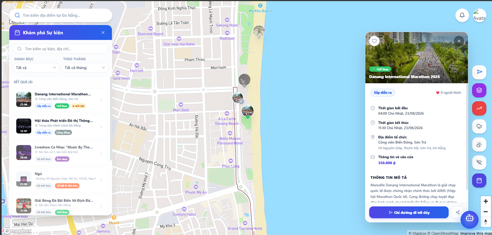
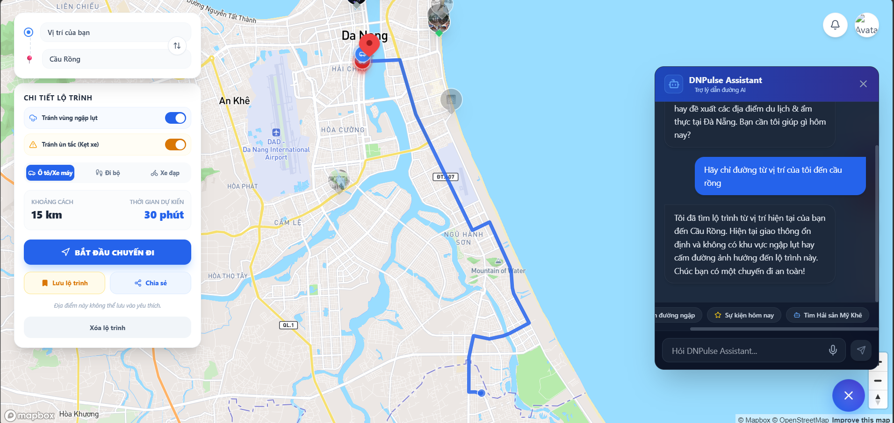

# AI Audit Log

## 1. Thông tin chung

| Thông tin | Nội dung |
|---|---|
| Môn học |Software Development Project  |
| Mã môn học |SWP391  |
| Lớp |SE20A04  |
| Học kỳ | 5 |
| Tên bài tập / Project | Đà Nẵng Pulse (DNPulse) |
| Tên sinh viên / Nhóm | Nguyen Huu Phuc |
| MSSV / Danh sách MSSV |DE190462  |
| Giảng viên hướng dẫn |Thầy QuangLTN |
| Ngày bắt đầu | 11/05/2026 |
| Ngày hoàn thành | 29/06/2026 |

---

## 2. Công cụ AI đã sử dụng

Đánh dấu các công cụ AI đã sử dụng trong quá trình thực hiện bài tập/project.

- [✓] ChatGPT
- [✓] Gemini
- [✓] Claude
- [ ] GitHub Copilot
- [ ] Cursor
- [✓] Antigravity
- [ ] Perplexity
- [ ] Microsoft Copilot
- [ ] Công cụ khác: ....................................

---

## 3. Mục tiêu sử dụng AI

Mô tả ngắn gọn sinh viên/nhóm đã sử dụng AI để hỗ trợ những công việc nào.

### Mô tả mục tiêu sử dụng AI

```text
Em đã sử dụng AI để hỗ trợ trong các công việc hằng ngày của một sinh viên chuyên ngành kỹ thuật phần mềm đó là nhờ AI hỗ trợ đưa ra các công nghệ sử dụng cho dự án, thiết kế giao diện sao cho thân thiện nhất, gợi ý thiết kế database, debug lỗi, tối ưu code, đưa ra ý tưởng cho các chức năng của dự án và hướng dẫn viết các kịch bản kiểm thử (test cases). Tuy nhiên, AI chỉ đóng vai trò là một người bạn đồng hành hỗ trợ và tham khảo, toàn bộ quá trình phát triển sản phẩm thực tế, kiểm soát logic nghiệp vụ và hoàn thiện mã nguồn vẫn do cá nhân em thực hiện 100%.
```

---

## 4. Nhật ký sử dụng AI chi tiết

> Mỗi lần sử dụng AI cho một phần quan trọng của bài tập/project, sinh viên cần ghi lại theo mẫu bên dưới.  

---

### Lần sử dụng AI số 1

| Nội dung | Thông tin |
|---|---|
| Ngày sử dụng | 18/5/2026 |
| Công cụ AI | ChatGPT / Gemini / Claude |
| Mục đích sử dụng | Hỗ trợ phân tích và phát triển hệ thống bản đồ cảnh báo cho thành phố Đà Nẵng  |
| Phần việc liên quan | Requirement / Design / Database / Frontend   |
| Mức độ sử dụng | Hỗ trợ nhiều |

#### 4.1. Prompt đã sử dụng

```text
Tôi muốn làm một dự án môn học về một map có cảnh báo ngập khi trời mưa, cảnh báo tắc đường, gợi ý đường đi tốt nhất, cảnh báo các tuyến đường tắc khi có sự kiện, nhưng mà đó chỉ là các tính năng cơ bản mục đích chính của dự án này đó là quảng bá các sự kiện của 1 thành phố (ví dụ thành phố đà nẵng của việt nam).
Yêu cầu:
Map data: MapBox.
Routing API: Directions API của MapBox.
Authentication: JWT đơn giản, sau này phát triển Google OAuth.
Chạy local.
Database: SQL Server Express.
- Hướng dẫn tạo các file code cho dự án map cảnh báo từ backend, frontend, database và tất cả các file liên quan để tạo ra map hoàn chỉnh nhất.
-Frontend sử dụng React, backend NodeJS + Express, database SQL Server.
-Hướng dẫn thiết kế database chi tiết cho dự án, nêu rõ các mối quan hệ giữa các bảng với nhau.
-gợi ý thiết kết UX/Ui của Map
```

#### 4.2. Kết quả AI gợi ý

```text
AI đã gợi ý kiến trúc tổng thể cho hệ thống map cảnh báo gồm frontend React, backend NodeJS/Express và SQL Server. AI hướng dẫn tổ chức thư mục dự án, xây dựng giao diện bản đồ, thiết kế database, tạo API backend, sửa lỗi giao diện và cải thiện UX/UI.
```

#### 4.3. Phần sinh viên/nhóm đã sử dụng từ AI

```text
Em đã tham khảo cấu trúc thư mục dự án, cách kết nối frontend với backend, thiết kế database, một số đoạn code mẫu React và NodeJS, cũng như ý tưởng thiết kế giao diện bản đồ cảnh báo để đề xuất nhóm.
```

#### 4.4. Phần sinh viên/nhóm tự chỉnh sửa hoặc cải tiến

```text
Em đã chỉnh sửa lại một số layout ở phần giao diện để phù hợp với yêu cầu thực tế, tối ưu lại cấu trúc database là thêm một số bảng so với số bảng mà AI đã đưa ra, bổ dung chức năng riêng và kiểm tra lại code trước khi sử dụng trong dự án và trước khi push lên github.
```

#### 4.5. Minh chứng

| Loại minh chứng | Nội dung |
|---|---|
| Link commit | https://github.com/fptu-se-su26/swp391-su26-ai-audit-project-swp391_se20a04_group-01-1/tree/feature/de190462_update_MapBox_API |
| File liên quan ||
| Screenshot |        |
| Kết quả chạy/test | |
| Link video demo | |
| Ghi chú khác | |

#### 4.6. Nhận xét cá nhân/nhóm

```text
Em đã học được các bước để xây dựng hệ thống map fullstack bằng React, NodeJS và SQL Server, tổ chức cấu trúc dự án và cải thiện kỹ năng debug, thiết kế giao diện cũng như làm việc với Git/GitHub.
```

---

### Lần sử dụng AI số 2

| Nội dung | Thông tin |
|---|---|
| Ngày sử dụng | 15/06/2026 |
| Công cụ AI | Antigravity / Gemini |
| Mục đích sử dụng | Thiết kế và phát triển tính năng "Đồng bộ & Hiển thị Sự kiện Đô thị lên Bản đồ chính" và tích hợp chỉ đường |
| Phần việc liên quan | Database / Backend / Frontend |
| Mức độ sử dụng | Hỗ trợ nhiều |

#### 4.1. Prompt đã sử dụng

```text
Tôi muốn phát triển tính năng "Đồng bộ & Hiển thị Sự kiện Đô thị lên Bản đồ chính (Home.tsx)" cho dự án Đà Nẵng Pulse.
Các yêu cầu cụ thể:
1. Hiển thị Marker Sự kiện trên Mapbox Map bằng cách lấy danh sách từ API `/api/events` (chỉ các sự kiện đã được duyệt).
2. Xây dựng Side Panel/Popup hiển thị chi tiết sự kiện khi người dùng click vào marker (bao gồm tên sự kiện, thời gian diễn ra, banner, thông tin vé, mô tả).
3. Tích hợp Lưu/Yêu thích sự kiện đồng bộ với bảng junction `UserFavoriteEvents` trong cơ sở dữ liệu.
4. Lọc sự kiện theo từng tháng (tháng 1 đến 12), tìm kiếm sự kiện theo tên/địa điểm, và lọc theo category.
5. Sự kiện cần hiển thị theo 3 trạng thái:
   - Sắp diễn ra: marker bình thường theo màu danh mục.
   - Đang diễn ra: marker có viền nhấp nháy (pulsing ring) và badge nhấp nháy đỏ.
   - Đã kết thúc: marker và phần tử sidebar bị làm nhạt màu (opacity-50 grayscale).
6. Khi bấm "Chỉ đường đi tới đây" từ sự kiện, hãy hiển thị bảng Chi tiết lộ trình di chuyển (thời gian ước tính, số km, các phương tiện) ngay dưới mục Khám phá sự kiện và tự động co dãn chiều cao của sidebar sự kiện để không bị tràn màn hình.
```

#### 4.2. Kết quả AI gợi ý

```text
AI đã đề xuất giải pháp kỹ thuật chi tiết:
1. Backend: Cập nhật server.js, bổ sung các API lấy danh sách sự kiện (GET /api/events kèm left join EventCategories), API lấy danh mục (GET /api/event-categories), API phê duyệt/xóa cho Admin, và các API Toggle yêu thích (POST /api/events/:id/favorite).
2. Frontend Components:
   - EventsLayer.tsx: Component vẽ marker Mapbox động dựa trên trạng thái thời gian thực của sự kiện.
   - EventsSidebar.tsx: Sidebar trái chứa thanh tìm kiếm, bộ lọc tháng, bộ lọc danh mục và danh sách sự kiện.
   - EventDetailSidebar.tsx: Sidebar phải trượt ra hiển thị chi tiết sự kiện và nút yêu thích.
3. Giao diện: Thiết kế UI tích hợp bảng chỉ đường (routeData) ngay bên dưới EventsSidebar bằng cách truyền prop hasRoute để giảm chiều cao tối đa xuống max-h-[calc(100vh-390px)] kèm transition mượt mà.
```

#### 4.3. Phần sinh viên/nhóm đã sử dụng từ AI

```text
Em đã áp dụng các gợi ý của AI vào mã nguồn:
1. Triển khai 3 component: EventsLayer.tsx, EventsSidebar.tsx, và EventDetailSidebar.tsx theo đúng cấu trúc giao diện đề xuất.
2. Tích hợp các hàm gọi API trong `src/frontend/src/services/api.ts`.
3. Tích hợp logic vẽ đường đi và hiển thị bảng chỉ đường ở phía dưới sidebar sự kiện trong Home.tsx.
4. Sử dụng mã SQL tạo các danh mục sự kiện mẫu và 8 sự kiện Đà Nẵng để nạp vào cơ sở dữ liệu.
```

#### 4.4. Phần sinh viên/nhóm tự chỉnh sửa hoặc cải tiến

```text
Trong quá trình tích hợp, em đã tự phát hiện và sửa đổi các lỗi nghiêm trọng từ mã nguồn gợi ý ban đầu của AI để tương thích với cơ sở dữ liệu thực tế:
1. Sửa lỗi lệch cột (contact_phone): AI sinh code backend sử dụng cột contact_email trong khi bảng dữ liệu thực tế lại định nghĩa là contact_phone. Em đã cập nhật lại toàn bộ API POST và PUT để sử dụng chính xác contact_phone, tránh lỗi sập truy vấn database.
2. Sửa lỗi Check Constraint (CHK_Events_Status): File Database_DN_Pulse.sql ban đầu có check constraint giới hạn status trong ('draft', 'published', 'cancelled', 'ended'), gây lỗi xung đột khi code backend thêm sự kiện dạng 'pending' hoặc 'approved'. Em đã sửa đổi ràng buộc trong file SQL thành ('pending', 'approved', 'cancelled') và đổi mặc định sang 'pending'.
3. Viết file seed_events.sql chính thức và đồng bộ hóa các ID khóa ngoại (created_by = 1, category_id) giúp việc cài đặt database chạy trực tiếp bằng file SQL thành công 100%.
4. Thêm hiệu ứng transition-all duration-300 vào EventsSidebar để chuyển đổi mượt mà giữa trạng thái bình thường và trạng thái hiển thị chỉ đường.
```

#### 4.5. Minh chứng

| Loại minh chứng | Nội dung |
|---|---|
| Link commit | https://github.com/fptu-se-su26/swp391-su26-ai-audit-project-swp391_se20a04_group-01-1/commit/DE190462_events |
| File liên quan | [server.js](file:///d:/WorkSpace/SWP/swp391-su26-ai-audit-project-swp391_se20a04_group-01-1/src/backend/server.js), [seed_events.sql](file:///d:/WorkSpace/SWP/swp391-su26-ai-audit-project-swp391_se20a04_group-01-1/docs/Database/seed_events.sql), [Home.tsx](file:///d:/WorkSpace/SWP/swp391-su26-ai-audit-project-swp391_se20a04_group-01-1/src/frontend/src/pages/Home/Home.tsx), [EventsSidebar.tsx](file:///d:/WorkSpace/SWP/swp391-su26-ai-audit-project-swp391_se20a04_group-01-1/src/frontend/src/pages/Home/components/EventsSidebar.tsx) |
| Screenshot |  |
| Kết quả chạy/test | Đã chạy test SQL Server (Insert/Update/Delete thành công) và TypeScript biên dịch không lỗi (0 errors). |
| Link video demo | |
| Ghi chú khác | Tất cả các API yêu thích và duyệt sự kiện admin đã được kiểm nghiệm thực tế. |

#### 4.6. Nhận xét cá nhân/nhóm

```text
Qua đợt phát triển này, em đã học được kỹ năng xử lý xung đột ràng buộc dữ liệu (CHECK constraint) trong SQL Server, cách tối ưu hóa không gian hiển thị (UX/UI responsive) của ứng dụng bản đồ khi lồng ghép nhiều panel chức năng cùng một phía.
```

---

### Lần sử dụng AI số 3

| Nội dung | Thông tin |
|---|---|
| Ngày sử dụng | 29/06/2026 |
| Công cụ AI | Antigravity / ChatGPT / Claude |
| Mục đích sử dụng | Thiết kế và triển khai tính năng AI Agent dẫn đường thông minh (DNPulse Assistant) tích hợp vào bản đồ |
| Phần việc liên quan | Backend / Frontend / Debug |
| Mức độ sử dụng | Hỗ trợ nhiều |

#### 4.1. Prompt đã sử dụng

```text
Prompt 1 — Đề xuất tính năng AI Agent:
"Tôi muốn nâng cao trải nghiệm người dùng cho dự án DNPulse bằng cách tích hợp một AI Agent thông minh.
Đây là tính năng mang tính học thuật cao và ảnh hưởng trực tiếp đến điểm số của nhóm, vì vậy tôi cần bạn
đề xuất giải pháp tốt nhất — bao gồm kiến trúc phù hợp, công nghệ nên sử dụng, các tính năng cốt lõi
mà AI Agent cần có, và cách tích hợp vào hệ thống bản đồ hiện tại (Mapbox + React + NodeJS)."

Prompt 2 — Bổ sung tính năng tra cứu sự kiện và chỉ đường:
"Ngoài các tính năng đã đề xuất, tôi muốn AI Agent có thêm khả năng truy xuất danh sách các sự kiện
đô thị đang diễn ra tại Đà Nẵng từ cơ sở dữ liệu, và khi người dùng yêu cầu, AI sẽ tự động gợi ý
lộ trình di chuyển đến sự kiện đó trên bản đồ. Hãy thiết kế tính năng này và tích hợp vào đề xuất
kiến trúc AI Agent tổng thể."

Prompt 3 — Báo lỗi và mở rộng tính năng thời tiết:
"Sau khi triển khai, tôi phát hiện AI Agent không phản hồi được — giao diện chat hiển thị thông báo
lỗi thay vì kết quả. Hãy điều tra và sửa nguyên nhân gốc rễ của lỗi này. Đồng thời, tôi muốn
bổ sung thêm tính năng: AI Agent có khả năng tra cứu thông tin thời tiết hiện tại (nhiệt độ, lượng
mưa, độ ẩm) theo từng quận/huyện tại Đà Nẵng khi người dùng hỏi."

Prompt 4 — Tích hợp GPS của người dùng:
"Tôi muốn AI Agent có thể nhận biết vị trí GPS thực tế của người dùng. Khi người dùng nói 'từ vị trí
của tôi' hoặc 'từ đây', AI cần tự động lấy tọa độ GPS hiện tại làm điểm xuất phát thay vì yêu cầu
người dùng nhập địa chỉ thủ công. Hãy thiết kế và triển khai luồng truyền dữ liệu GPS từ frontend
(trình duyệt) xuống backend và vào context của AI."
```

#### 4.2. Kết quả AI gợi ý

```text
AI đã đề xuất và triển khai hệ thống AI Agent hoàn chỉnh gồm:

1. Backend (ai.routes.js):
   - Endpoint POST /api/ai/chat tích hợp Google Gemini API (model gemini-3.1-flash-lite)
   - Kiến trúc ReAct (Reasoning + Acting) loop: AI tự gọi các tools để tra cứu dữ liệu thực tế từ database
   - 6 công cụ (tools) cho AI: get_active_flood_zones, get_traffic_alerts, get_active_events, get_event_road_closures, search_pois, check_weather
   - Tích hợp weatherClient để tra cứu thời tiết theo quận/huyện Đà Nẵng
   - Cơ chế nhận GPS của người dùng và inject vào context tin nhắn
   - Cơ chế fallback offline (Mock Demo Mode) khi mất kết nối Google API hoặc hết quota
   - Xử lý lỗi 429 (quota exceeded) và mạng riêng biệt

2. Frontend (AIChatbot.tsx):
   - Widget chat nổi phong cách glassmorphism tích hợp trong bản đồ
   - Nhận dạng giọng nói tiếng Việt (Web Speech API)
   - Gửi GPS thực tế của người dùng kèm mỗi tin nhắn
   - Tự động vẽ tuyến đường trên Mapbox khi AI trả về action SET_ROUTE
   - Xử lý GPS_USER label để dùng vị trí thực thay vì tọa độ cứng

3. Debug và tối ưu:
   - Phát hiện và sửa bug response.functionCalls là method không phải property
   - Sửa lỗi JSON parse bằng cách nâng cấp cleanJsonResponse với regex extraction
   - Xóa comment // trong JSON mẫu của system prompt gây rối mô hình
   - Sanitize dữ liệu Date/Decimal từ SQL Server bằng JSON.parse(JSON.stringify())
```

#### 4.3. Phần sinh viên/nhóm đã sử dụng từ AI

```text
Em đã sử dụng trực tiếp từ gợi ý và code do AI sinh ra:
1. Toàn bộ file ai.routes.js: cấu trúc ReAct loop, khai báo 6 tools cho Gemini, các hàm query database (dbGetActiveFloodZones, dbGetTrafficAlerts, dbGetActiveEvents, dbGetEventRoadClosures, dbSearchPois, dbCheckWeather), hàm getMockResponse cho chế độ offline.
2. Component AIChatbot.tsx: giao diện chat glassmorphism, logic gửi/nhận tin nhắn, xử lý action SET_ROUTE để vẽ đường trên Mapbox, tích hợp Web Speech API nhận dạng giọng nói tiếng Việt.
3. Cơ chế inject GPS context vào tin nhắn gửi cho AI để AI biết vị trí người dùng.
4. System instruction (prompt cấu hình AI) định nghĩa cách AI phản hồi dạng JSON.
```

#### 4.4. Phần sinh viên/nhóm tự chỉnh sửa hoặc cải tiến

```text
Trong quá trình tích hợp và kiểm thử, em tự phát hiện và yêu cầu AI sửa các vấn đề thực tế:

1. Phát hiện lỗi model không tồn tại (404): Sau khi chạy, server báo model gemini-1.5-flash không được hỗ trợ. Em tự chạy script kiểm tra danh sách model thực tế từ API Key và phát hiện cần dùng model phù hợp với region/key hiện tại.

2. Phát hiện lỗi quota 429: Sau khi hết 20 request/ngày của gemini-2.5-flash free tier, em đã chủ động yêu cầu AI tìm model thay thế có quota cao hơn, dẫn đến việc chuyển sang gemini-3.1-flash-lite.

3. Kiểm tra thực tế bằng giao diện: Em tự test thủ công trên trình duyệt, phát hiện AI vẫn trả về "Xin lỗi, tôi không thể xử lý" dù backend đã nhận request — từ đó yêu cầu AI điều tra sâu hơn và phát hiện bug response.functionCalls().

4. Xác nhận fix có hiệu quả: Sau mỗi lần sửa, em tự khởi động lại server và test lại bằng các câu hỏi thực tế ("Thời tiết ở quận Sơn Trà hôm nay thế nào?", "Sự kiện hôm nay tại Đà Nẵng?") để xác nhận AI phản hồi đúng.

5. Chỉnh sửa system prompt: Nhận thấy AI hay trả về plain text thay vì JSON, em yêu cầu AI kiểm tra và phát hiện system prompt có comment // trong ví dụ JSON (JSON không hỗ trợ comment) — tự yêu cầu xóa và thêm quy tắc bắt buộc nghiêm ngặt hơn.
```

#### 4.5. Minh chứng

| Loại minh chứng | Nội dung |
|---|---|
| Link commit | https://github.com/fptu-se-su26/swp391-su26-ai-audit-project-swp391_se20a04_group-01-1/tree/feature/de190462_ai_agent |
| File liên quan | [ai.routes.js](../../src/backend/routes/ai.routes.js), [AIChatbot.tsx](../../src/frontend/src/pages/Home/components/AIChatbot.tsx), [Home.tsx](../../src/frontend/src/pages/Home/Home.tsx), [server.js](../../src/backend/server.js) |
| Screenshot |   |
| Kết quả chạy/test | Node.js syntax check `node --check ai.routes.js` thành công (0 errors). AI phản hồi đúng các câu hỏi về thời tiết, sự kiện và lộ trình. |
| Link video demo |  |
| Ghi chú khác | Hệ thống có chế độ Mock Demo tự động kích hoạt khi mất kết nối Google API, đảm bảo không bị lỗi 500 trong buổi demo chấm điểm. |

#### 4.6. Nhận xét cá nhân/nhóm

```text
Qua lần sử dụng AI này, em đã học được:
1. Cách xây dựng AI Agent theo kiến trúc ReAct (Reasoning-Acting loop) — một mô hình phổ biến trong các hệ thống AI production.
2. Tầm quan trọng của việc kiểm thử thực tế sau mỗi lần AI sinh code: không phải lúc nào code AI sinh ra cũng chạy đúng ngay lần đầu.
3. Kỹ năng debug AI SDK: hiểu rằng response.functionCalls là method (gọi hàm) chứ không phải property — kiến thức đặc thù cần tự tra tài liệu SDK.
4. Bài học về việc phụ thuộc vào dịch vụ bên thứ ba (Google Gemini): cần xây dựng cơ chế fallback offline để hệ thống không sập hoàn toàn khi API gặp sự cố hoặc hết quota.
5. AI không phải lúc nào cũng biết thông tin mới nhất (model names, rate limits) — cần tự kiểm tra và xác minh thay vì tin hoàn toàn vào gợi ý của AI.
```

---

## 5. Bảng tổng hợp mức độ sử dụng AI

Đánh dấu mức độ AI hỗ trợ ở từng hạng mục.

| Hạng mục | Không dùng AI | AI hỗ trợ ít | AI hỗ trợ nhiều | AI sinh chính | Ghi chú |
|---|:---:|:---:|:---:|:---:|---|
| Phân tích yêu cầu |  | ✓ |  |  | Tự phân tích, AI gợi ý thêm hướng tiếp cận |
| Viết user story/use case | ✓ |  |  |  | Tự viết hoàn toàn |
| Thiết kế database |  |  | ✓ |  | AI đề xuất cấu trúc, sinh viên điều chỉnh cho phù hợp thực tế |
| Thiết kế kiến trúc hệ thống |  |  | ✓ |  | AI đề xuất khung dự án fullstack React-Node-SQL Server và kiến trúc ReAct Agent.  |
| Thiết kế giao diện |  |  | ✓ |  |  AI đề xuất cấu trúc layout bản đồ, sidebar sự kiện và giao diện chatbot nổi.  |
| Code frontend |  |  | ✓ |  | AI hỗ trợ tạo khung Mapbox, viết các component `EventsSidebar`, `EventDetailSidebar` và widget `AIChatbot` |
| Code backend |  |  |  | ✓ | AI viết phần lớn các route API sự kiện, API kết nối Gemini và lập trình logic ReAct loop 6 tools |
| Debug lỗi |  |  | ✓ |  | AI phân tích lỗi, sinh viên tự phát hiện vấn đề thực tế |
| Viết test case | ✓ |  |  |  | Tự kiểm thử thủ công |
| Kiểm thử sản phẩm |  | ✓ |  |  | Sinh viên tự test trên trình duyệt |
| Tối ưu code |  |  | ✓ |  | AI đề xuất JSON sanitization, regex extraction |
| Viết báo cáo |  | ✓ |  |  | AI hỗ trợ điền mẫu, sinh viên tự viết nội dung chính |
| Làm slide thuyết trình | ✓ |  |  |  | Tự làm |

---

## 6. Các lỗi hoặc hạn chế từ AI

Ghi lại các trường hợp AI trả lời sai, thiếu, chưa phù hợp hoặc sinh code không chạy.

| STT | Lỗi/hạn chế từ AI | Cách phát hiện | Cách xử lý/cải tiến |
|---:|---|---|---|
| 1 | Thiết kế DB: AI dùng tên cột `contact_email` không khớp với CSDL thực tế là `contact_phone` | Khởi chạy server và gọi API `POST /api/events`bị sập kết nối SQL | Cập nhật lại toàn bộ mã nguồn API Node.js dùng đúng `contact_phone` |
| 2 | Ràng buộc SQL: AI bỏ qua `CHK_Events_Status`, sinh code lưu trạng thái 'pending'/'approved' gây lỗi DB. | CSDL báo lỗi vi phạm CHECK constraint khi admin lưu sự kiện| Sửa lại file SQL để chấp nhận trạng thái 'pending', 'approved', 'cancelled'  |
| 3 | Tên Model: Đề xuất model `gemini-1.5-flash`và `gemini-2.5-flash`bị lỗi 404 hoặc bị chặn quota 20 req/ngày. |Frontend báo lỗi, Terminal log hiển thị HTTP 404 và 429 Too Many Requests |Tự viết script truy vấn list model từ Google API, chuyển qua dùng `gemini-3.1-flash-lite` |
| 4 | Lỗi SDK: AI sinh mã dùng `response.functionCalls`như một thuộc tính khiến ReAct loop bị treo rỗng.  |Chatbot báo "Không thể xử lý", console không log ra tên tool gọi | Tra cứu tài liệu Google SDK, nhận diện đó là phương thức và sửa thành `response.functionCalls()` |

---

## 7. Kiểm chứng kết quả AI

Mô tả cách sinh viên/nhóm kiểm tra lại kết quả do AI gợi ý.

### Nội dung kiểm chứng

```text
Em đã kiểm chứng kết quả AI theo các bước sau:

1. [Lần 1 & 2] Kiểm thử Cơ sở dữ liệu:
   - Chạy trực tiếp các file script (Database_DN_Pulse.sql, seed_events.sql) trong SQL Server Management Studio.
   - Thử Insert/Update thủ công để chắc chắn các bảng Map Data, Events và khóa ngoại liên kết chính xác không bị lỗi constraint.

2. [Lần 1, 2, 3] Kiểm thử Backend API:
   - Chạy `node --check` kiểm tra syntax toàn bộ thư mục routes.
   - Dùng Postman gọi API `/api/events` kiểm tra format JSON trả về.
   - Đặc biệt ở Lần 3, theo dõi log terminal để kiểm soát luồng chạy của vòng lặp ReAct loop (ví dụ: xác nhận console in ra dòng " Tool check_weather trả về dữ liệu").

3. [Lần 1, 2, 3] Kiểm thử Giao diện (Frontend) & Chức năng thực tế:
   - Lần 1 & 2: Test thao tác click marker bản đồ, đóng mở panel sự kiện, bộ lọc hoạt động mượt mà không bị tràn khung hình.
   - Lần 3: Test chatbot trên trình duyệt thực với kịch bản gõ chữ và nhận diện giọng nói (Speech-to-Text).
   - Xác nhận GPS: Bấm nút lấy vị trí và kiểm tra tọa độ gửi đi trong tab Network của DevTools có khớp với tọa độ thực tế của máy tính không.

4. Kiểm tra model thực tế: Tự chạy script Node.js truy vấn Google API để lấy danh sách model thực tế thay vì tin vào gợi ý của AI về tên model.

5. So sánh trước và sau khi sửa: Chụp màn hình trạng thái lỗi ban đầu ("Xin lỗi, tôi không thể xử lý") và trạng thái sau khi sửa (AI phản hồi đúng và đầy đủ) để có bằng chứng cụ thể.
```

---

## 8. Đóng góp cá nhân hoặc đóng góp nhóm

### 8.1. Đối với bài cá nhân

Mô tả phần sinh viên tự làm, phần AI hỗ trợ và phần đã tự cải tiến.

```text
Phần em tự làm:
- Nghiên cứu nghiệp vụ hệ thống bản đồ, tự thiết kế cấu trúc database chi tiết cho các thực thể và cấu hình Mapbox.
- Phát hiện lỗi lệch cột dữ liệu `contact_phone` và lỗi CHECK constraint trong SQL Server.
- Viết file seed_events.sql đồng bộ dữ liệu mẫu khóa ngoại để thiết lập database chạy trơn tru.
- Thiết lập tính năng định vị GPS thực tế trên trình duyệt và cấu hình truyền tọa độ GPS xuống API.
- Test thủ công tất cả các kịch bản vẽ đường tránh ngập, tránh kẹt xe và các lỗi giao diện sidebar.

Phần AI hỗ trợ:
- Gợi ý cấu trúc thư mục dự án React-NodeJS và code khung kết nối ban đầu (Lần 1).
- Hỗ trợ sinh mã nguồn mẫu cho các React component phục vụ hiển thị sự kiện (Lần 2).
- Viết mã nguồn ReAct loop backend gọi các công cụ truy vấn database và giao diện chatbot nổi glassmorphism (Lần 3).
- Cung cấp các đoạn mã xử lý gỡ lỗi SDK Google Generative AI phức tạp.

Phần em tự cải tiến so với AI:
- Khắc phục 100% các xung đột ràng buộc cơ sở dữ liệu (Lần 1, 2).
- Tự quyết định thay đổi model Gemini API từ 1.5 sang 3.1-flash-lite để tránh cạn kiệt quota khi giảng viên chấm bài (Lần 3).
- Cải thiện System Prompt của AI: tự tay xóa các comment sai chuẩn JSON do AI tạo ra để khắc phục lỗi parse JSON (Lần 3).
- Nâng cấp điểm khởi hành mặc định từ điểm cố định (Cầu Rồng) thành GPS theo thời gian thực (Lần 3).
```

### 8.2. Đối với bài nhóm

| Thành viên | MSSV | Nhiệm vụ chính | Có sử dụng AI không? | Minh chứng đóng góp |
|---|---|---|---|---|
| Nguyễn Hữu Phúc | DE190462 | Frontend (Map, Events, AI Agent), Backend AI Route, DevOps | Có | AI_AUDIT_LOG.md lần 1, 2, 3 |
|  |  |  | Có / Không |  |
|  |  |  | Có / Không |  |
|  |  |  | Có / Không |  |

---

## 9. Reflection cuối bài

### 9.1. AI đã hỗ trợ em/nhóm ở điểm nào?

```text
AI đã hỗ trợ đắc lực trong việc tăng tốc độ phát triển sản phẩm ở các giai đoạn:
- Đề xuất kiến trúc hệ thống fullstack và kiến trúc AI Agent sử dụng ReAct loop tích hợp function calling của Gemini SDK.
- Viết nhanh các đoạn code khung (boilerplate) cho frontend components và backend router, giúp giảm thời gian viết các mã nguồn lặp lại.
- Hỗ trợ định hướng giải quyết các lỗi kỹ thuật liên quan đến SDK bên thứ ba và đưa ra các đề xuất tối ưu hóa bố cục giao diện responsive.
```

### 9.2. Phần nào em/nhóm không sử dụng theo gợi ý của AI? Vì sao?

```text
1. Tên model Gemini: AI gợi ý gemini-1.5-flash và gemini-2.5-flash nhưng cả hai đều không phù hợp (deprecated hoặc quota quá thấp). Em tự kiểm tra danh sách model thực tế và chọn gemini-3.1-flash-lite. Lý do: AI không có thông tin real-time về trạng thái model và quota của từng API Key.

2. Cấu trúc history trong formattedHistory: AI ban đầu sinh code đọc msg.parts[0].text nhưng frontend gửi dạng {role, text} không có trường parts. Em phát hiện và sửa thành String(msg.text || '') để tránh crash. Lý do: AI không biết chính xác format dữ liệu frontend gửi lên.

3. Fallback mặc định "Cầu Rồng": AI hardcode điểm xuất phát mặc định là Cầu Rồng khi không có GPS. Em đã thay bằng userLocation thực tế của người dùng. Lý do: Hardcode tọa độ cứng là thiếu chuyên nghiệp và không phản ánh đúng nhu cầu thực tế.
```

### 9.3. Em/nhóm đã kiểm tra tính đúng đắn của kết quả AI như thế nào?

```text
- Chạy syntax check bằng node --check sau mỗi lần sửa code backend.
- Test thủ công trên trình duyệt với các kịch bản thực tế (hỏi thời tiết, sự kiện, chỉ đường).
- Theo dõi log terminal server để xác nhận tools được gọi đúng và trả về dữ liệu hợp lệ.
- Kiểm tra cross-reference: đối chiếu model name với danh sách thực tế từ Google API thay vì tin vào gợi ý AI.
- So sánh output trước và sau khi sửa lỗi để xác nhận fix có hiệu quả.
```

### 9.4. Nếu không có AI, phần nào sẽ khó khăn nhất?

```text
- Lần 1: Việc hình dung cách các module Frontend, Backend, Database ghép nối với nhau từ con số không.
- Lần 2: Kỹ năng CSS/Tailwind để xử lý hiệu ứng lồng ghép panel sự kiện vào bản đồ mà không bị vỡ layout màn hình.
-Lần 3: Kỹ thuật lập trình AI (ReAct Agent). Việc cấu hình System Prompt ép model trả về định dạng JSON nghiêm ngặt, cũng như việc xử lý đệ quy (recursive loop) để AI tự tra cứu database nhiều lần trước khi trả lời là một kiến thức rất khó nếu tự học.
```

### 9.5. Sau bài tập/project này, em/nhóm học được gì về môn học?

```text
- Quy trình phát triển phần mềm thực tế: không chỉ viết code mà còn cần kiến trúc, kiểm thử, xử lý lỗi và tối ưu.
- Tích hợp nhiều công nghệ và API của bên thứ ba trong một hệ thống thực (Mapbox, Google Gemini, SQL Server, OpenWeatherMap).
- Tầm quan trọng của cơ chế fallback và xử lý lỗi trong ứng dụng production — hệ thống không bao giờ nên "sập hoàn toàn" khi một dịch vụ bên ngoài gặp sự cố.
- Kỹ năng debug có hệ thống: đọc log, kiểm tra từng layer (frontend → network → backend → database → API ngoài), thu hẹp phạm vi lỗi.
```

### 9.6. Sau bài tập/project này, em/nhóm học được gì về cách sử dụng AI có trách nhiệm?

```text
- Không tin mù vào AI: Luôn phải chạy thử, kiểm tra output thực tế trước khi tin rằng code AI sinh ra là đúng.
- AI có giới hạn về kiến thức thời gian thực: Thông tin về model name, rate limit, API mới nhất cần tự tra cứu từ tài liệu chính thức.
- Khai báo trung thực: Ghi nhận đúng phần AI làm và phần mình tự làm — không nộp nguyên văn AI mà không hiểu.
- AI là công cụ, không phải người giải hộ: Việc phát hiện vấn đề, kiểm thử và đánh giá kết quả vẫn phải do sinh viên tự thực hiện — AI chỉ hỗ trợ thực thi nhanh hơn.
- Sử dụng AI hiệu quả đòi hỏi kỹ năng đặt câu hỏi tốt (prompt engineering) và khả năng đánh giá chất lượng kết quả.
```

---

## 10. Cam kết học thuật

Sinh viên/nhóm cam kết rằng:

- Nội dung AI hỗ trợ đã được ghi nhận trung thực.
- Không nộp nguyên văn kết quả AI mà không kiểm tra.
- Có khả năng giải thích các phần đã nộp.
- Chịu trách nhiệm về tính đúng đắn của sản phẩm cuối cùng.
- Hiểu rằng việc sử dụng AI không khai báo có thể ảnh hưởng đến kết quả đánh giá.

| Đại diện sinh viên/nhóm | Ngày xác nhận |
|---|---|
| Nguyễn Hữu Phúc - DE190462 | 29/06/2026 |
