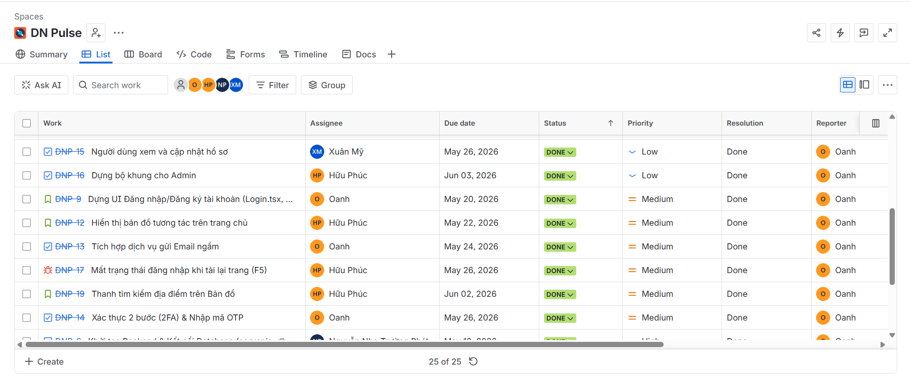
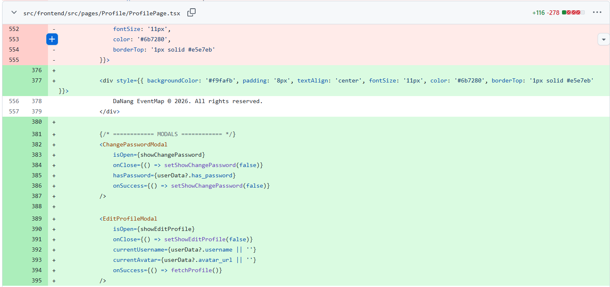
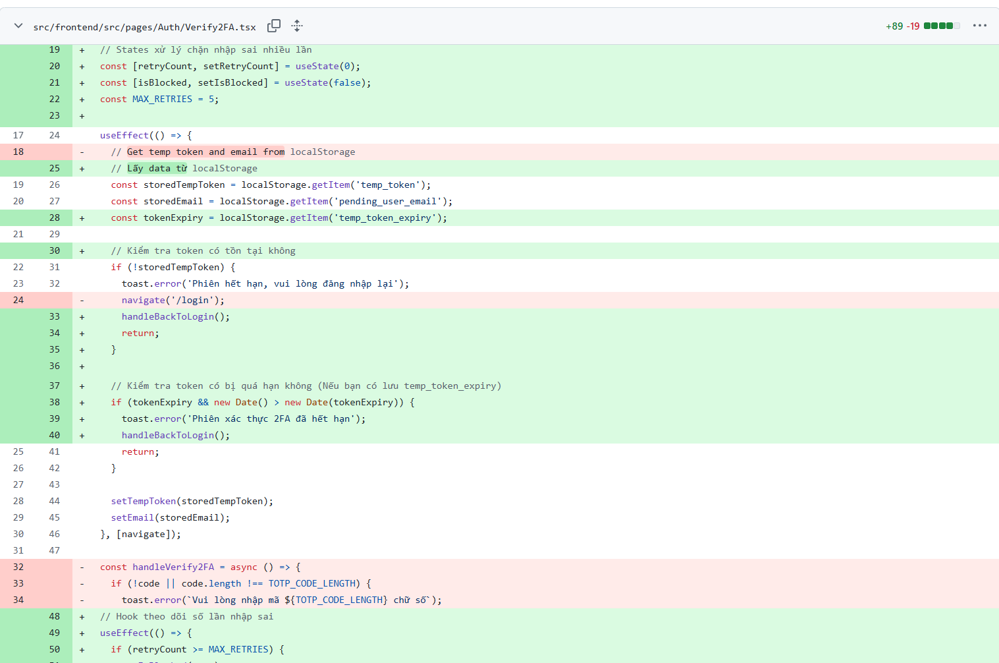
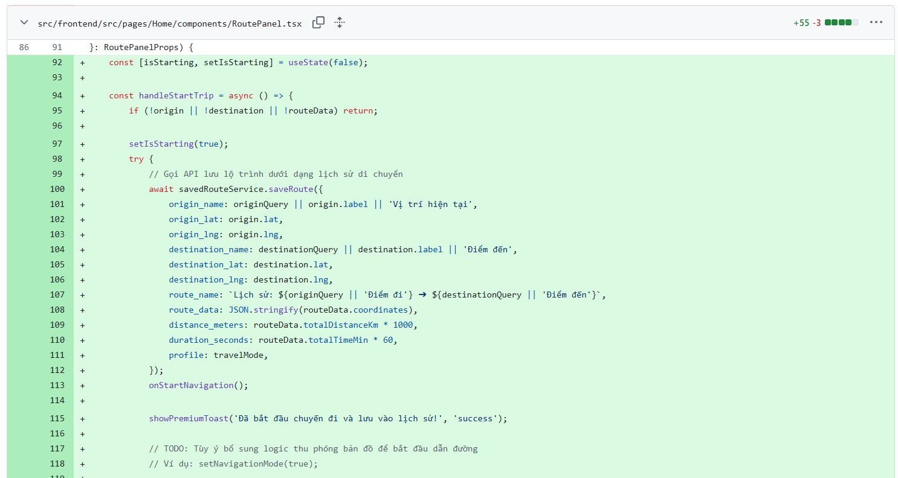
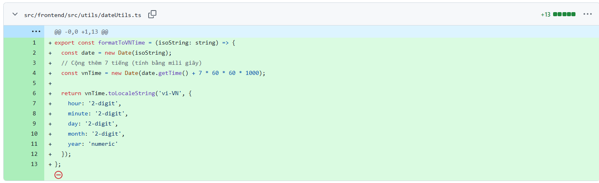
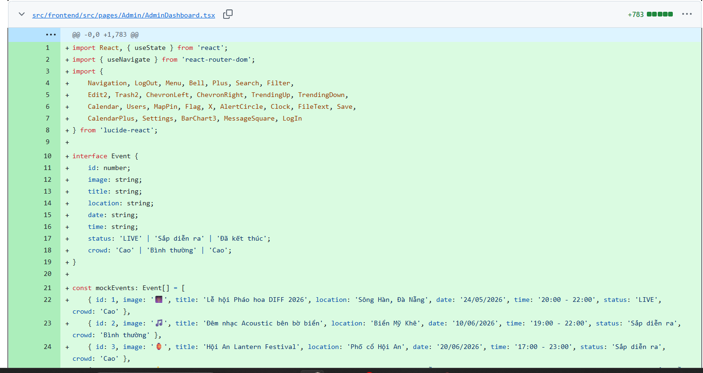
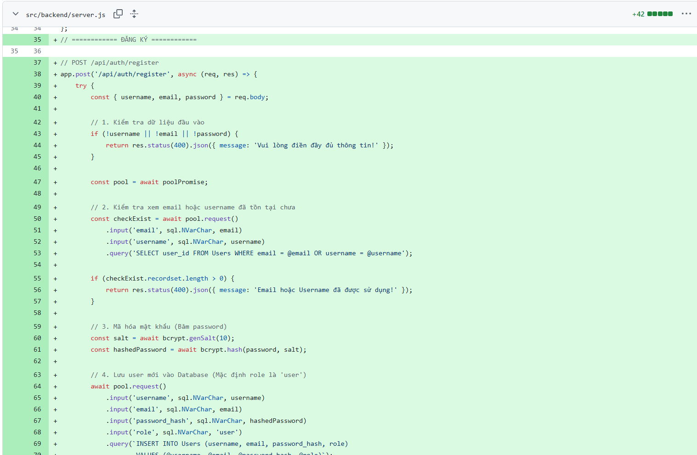
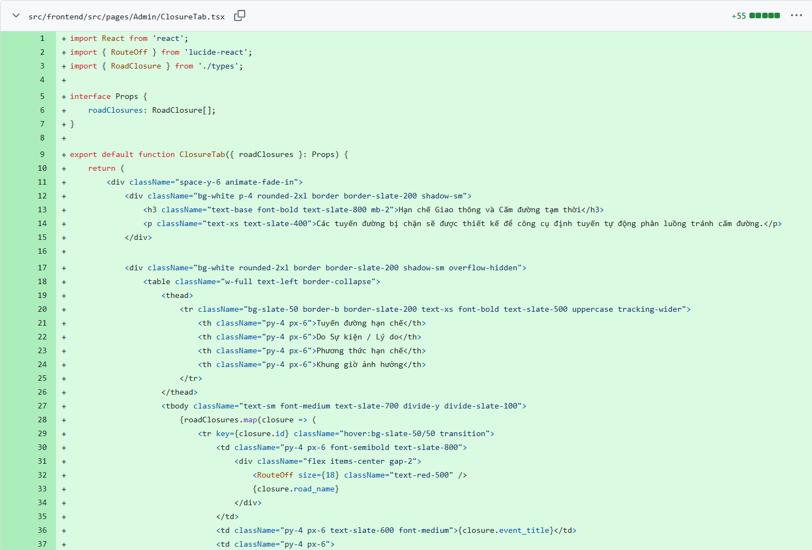
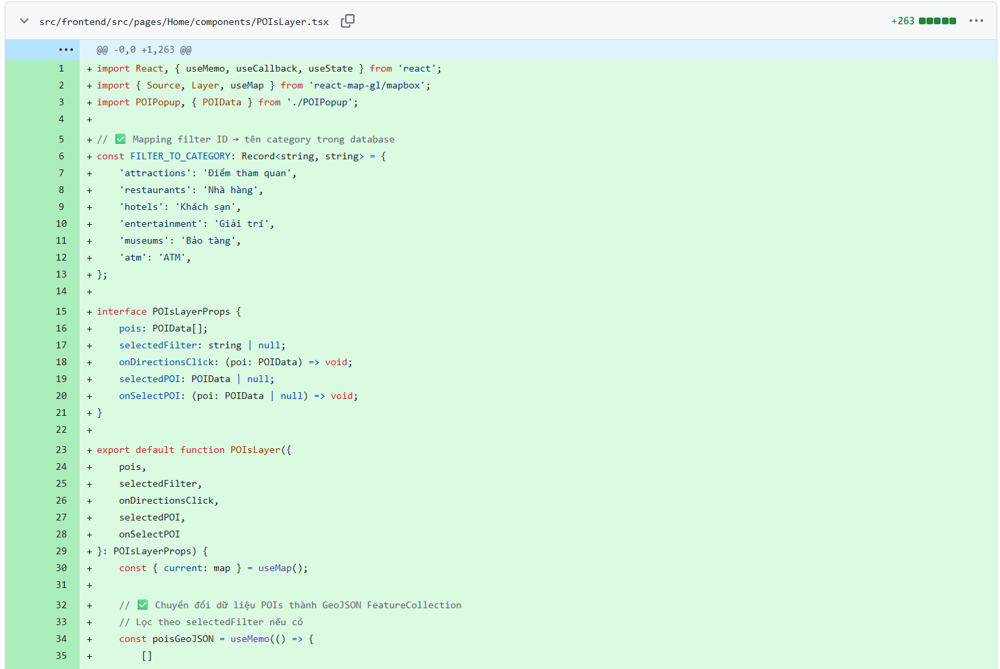

# AI Audit Log

## 1. Thông tin chung

| Thông tin | Nội dung |
|---|---|
| Môn học | Software Development Project |
| Mã môn học | SWP391 |
| Lớp | SE20A04 |
| Học kỳ | SU26 |
| Tên bài tập / Project | DN-Pulse: Intelligent Urban Routing System |
| Tên sinh viên | Tô Thị Oanh |
| MSSV | DE191103 |
| Giảng viên hướng dẫn | QuangLTN |
| Ngày bắt đầu | 11/05/2026 |
| Ngày hoàn thành |  |

---

## 2. Công cụ AI đã sử dụng

Đánh dấu các công cụ AI đã sử dụng trong quá trình thực hiện bài tập/project.

- [✓] ChatGPT
- [✓] Gemini
- [✓] Claude
- [✓] GitHub Copilot
- [ ] Cursor
- [✓] Antigravity
- [ ] Perplexity
- [ ] Microsoft Copilot
- [ ] Công cụ khác: ....................................

---

## 3. Mục tiêu sử dụng AI

- Phân tích rủi ro của cơ chế đăng nhập hardcoded.
- Tư vấn kiến trúc xác thực không lưu trạng thái sử dụng JWT.
- Thiết kế luồng phân quyền người dùng.

## 4. Nhật ký sử dụng AI chi tiết

> Mỗi lần sử dụng AI cho một phần quan trọng của bài tập/project, sinh viên cần ghi lại theo mẫu bên dưới.  
> Sinh viên có thể nhân bản mẫu “Lần sử dụng AI” nhiều lần tùy theo số lần sử dụng AI thực tế.

---

### Lần sử dụng AI số 1

| Nội dung | Thông tin |
|---|---|
| Ngày sử dụng | 24/05/2026 |
| Công cụ AI |Gemini, GitHub Copilot|
| Mục đích sử dụng | Thiết kế stateless auth và luồng phân quyền Role-Based Access Control bằng JWT để thay thế cho hardcode |
| Phần việc liên quan | Design, Frontend, Backend|
| Mức độ sử dụng |Hỗ trợ một phần|

#### 4.1. Prompt đã sử dụng

I want to replace hardcoded admin credentials with JWT for Login and Authorization in my React/Node.js project. What are the benefits? Do I still need a database if I use JWT? Explain the flow simply and give me the code to implement this.

#### 4.2. Kết quả AI gợi ý

Tóm tắt nội dung AI đã trả lời hoặc gợi ý.

- Về kiến trúc: AI giải thích rằng JWT không thay thế Database (DB vẫn dùng để check user/pass), JWT có nhiệm vụ Authorization dựa theo mô hình Stateless.
- Về code: AI cung cấp code sign token bằng jsonwebtoken ở backend Node.js. Ở frontend, AI gợi ý lưu token này vào localStorage.

#### 4.3. Phần sinh viên đã sử dụng từ AI

Mô tả rõ phần nào được sử dụng lại từ gợi ý của AI.

Sử dụng bộ khung do AI cung cấp: Dùng thư viện jsonwebtoken để tạo/giải mã token, áp dụng bcrypt để băm mật khẩu an toàn, dùng Axios Interceptor để tự động nhét token vào header của mỗi request.
#### 4.4. Phần sinh viên  tự chỉnh sửa hoặc cải tiến

Mô tả sinh viên đã thay đổi, kiểm tra, sửa lỗi hoặc cải tiến gì so với gợi ý ban đầu của AI.
1. Rút ngắn thời hạn Token : 
  Trong code mẫu, token được set thời gian: 7 ngày. Thấy được cấu hình này rủi ro cao vì nếu token bị đánh cắp, hacker có thể sử dụng nó trong thời gian dài. Vì vậy, sửa lại thời gian của token là 1 ngày để đảm bảo an toàn .

  2. Xử lý lỗi giao diện không cập nhật đúng quyền : 
  Khi chuyển hướng người dùng sau khi đăng nhập, AI dùng hook useNavigate('/dashboard') của React. Khi test thử thì có lỗi: trang không được làm mới hoàn toàn khiến thanh Navbar đôi khi bị kẹt ở trạng thái cũ. Quyết định đổi sang dùng `window.location.href` (file `Login.tsx`). Để ép trình duyệt tải lại trang 100%, giúp hệ thống cập nhật đúng và ngay lập tức quyền của Admin/User.

  3. Tối ưu trải nghiệm người dùng - UI/UX : 
  AI chỉ cho logic đăng nhập cơ bản nhưng bỏ qua độ trễ mạng thực tế. Bổ sung thêm state loading và errorMsg để quản lý giao diện. Khi submit, nút Đăng nhập sẽ tự động bị vô hiệu hóa để chặn spam request. Nếu đăng nhập thất bại, hệ thống cũng sẽ báo câu lỗi trực tiếp trên màn hình thay vì giao diện bị đơ không phản hồi.


#### 4.5. Minh chứng

Đây là các hình ảnh từ source code thực tế của dự án, minh chứng cho các quyết định điều chỉnh và tối ưu hóa:

**1. Minh chứng lịch sử trò chuyện và lấy code khung (Boilerplate) từ AI**


*Ảnh chụp màn hình cho thấy việc đặt prompt yêu cầu AI giải thích sự khác biệt giữa JWT và Database, đồng thời xin code mẫu.*


*AI đính chính lại kiến trúc (JWT không thay thế Database mà hoạt động song song) và bắt đầu cung cấp code cấu hình Backend.*


*Phần code Frontend (Axios Interceptor và React Router) do AI gen ra để nhóm sử dụng làm bộ khung nền tảng.*

2. Minh chứng siết chặt bảo mật Token (Tệp `server.js`)**


* Code gốc AI để thời gian token là 7 ngày. Đã rút ngắn thời gian từ 7 ngày xuống còn 1 ngày để giảm thiểu rủi ro bảo mật.*

**3. Minh chứng xử lý lỗi điều hướng giao diện (Tệp `Login.tsx`)**


*Bỏ code useNavigate của AI vì bị lỗi kẹt Navbar, thay thế bằng `window.location.href` để ép trình duyệt làm mới trang 100%, khắc phục triệt để lỗi kẹt trạng thái Navbar.*

**4. Minh chứng tối ưu trải nghiệm người dùng UI/UX (Tệp `Login.tsx`)**


*Code AI không xử lý lúc mạng lag, viết thêm state loading để khóa nút chống spam, và errorMsg để báo lỗi trực tiếp ra màn hình cho dễ nhìn.*

#### 4.6. Nhận xét cá nhân


---

### Lần sử dụng AI số 2

| Nội dung | Thông tin |
|---|---|
| Ngày sử dụng | 28/05/2026 |
| Công cụ AI | ChatGPT / Gemini / Claude |
| Mục đích sử dụng | Thiết kế luồng phân quyền RBAC, truy xuất danh sách người dùng qua Database View và quản lý duyệt cảnh báo giao thông. |
| Phần việc liên quan | Database / Backend / Admin |
| Mức độ sử dụng | Hỗ trợ ý tưởng và sinh code mẫu |

#### 4.1. Prompt đã sử dụng

How can I create SQL Database Views to quickly load user lists for an Admin Dashboard? Also, give me a logic flow to manage and approve traffic alerts submitted by users.

#### 4.2. Kết quả AI gợi ý

AI cung cấp cú pháp CREATE VIEW trong SQL để JOIN các bảng liên quan đến User và Role. Đối với cảnh báo giao thông, AI gợi ý mô hình trạng thái 3 bước: Pending (Chờ duyệt) -> Approved (Chấp nhận) / Rejected (Từ chối).

#### 4.3. Phần sinh viên đã sử dụng từ AI

Sử dụng trực tiếp các cấu trúc lệnh tạo Database View của AI. Áp dụng mô hình quản lý trạng thái (Pending/Approved/Rejected) cho luồng kiểm duyệt cảnh báo giao thông.

#### 4.4. Phần sinh viên tự chỉnh sửa hoặc cải tiến

Tối ưu View: Tùy chỉnh lại các trường (fields) trong SQL View để khớp với thiết kế ERD, bổ sung thêm các cột trạng thái ban/unban tài khoản.

Bảo mật Route: Tự viết middleware Role-Based Access Control (RBAC) để bảo vệ tuyệt đối các API của Admin, chặn user thường.

Quản lý dự án: Tự thiết lập không gian làm việc trên Jira, tạo các task CRUD liên quan đến module này và quản lý quyền Rovo cho team.

#### 4.5. Minh chứng

| Loại minh chứng | Nội dung |
|---|---|
| Link commit |  |
| File liên quan |  |
| Screenshot | |
| Kết quả chạy/test |  |
| Link video demo |  |
| Ghi chú khác |  | 

#### 4.6. Nhận xét cá nhân

```text
Viết tại đây...
```

---

### Lần sử dụng AI số 3

| Nội dung | Thông tin |
|---|---|
| Ngày sử dụng | 29/05/2026 |
| Công cụ AI | Gemini |
| Mục đích sử dụng | Hoàn thiện logic backend và frontend cho tính năng Quản lý hồ sơ. |
| Phần việc liên quan | Backend / Profile Management|
| Mức độ sử dụng | Sinh nội dung boilerplate |

#### 4.1. Prompt đã sử dụng

How to structure a secure API to update user profile data in Node.js, validate inputs, and ensure data integrity in the database?
#### 4.2. Kết quả AI gợi ý

AI cung cấp khung code cho Controller sử dụng express-validator để kiểm tra các trường dữ liệu (tên, số điện thoại, email) trước khi thực hiện truy vấn DB. AI cũng gợi ý sử dụng req.params để xác định user đang thực hiện thay đổi và khuyến nghị sử dụng try-catch để bắt lỗi database.

#### 4.3. Phần sinh viên đã sử dụng từ AI

Sử dụng bộ khung định tuyến (route) và cấu trúc middleware của express-validator để thiết lập quy tắc validation cho các trường dữ liệu hồ sơ, đảm bảo không có dữ liệu rác (junk data) lọt vào DB.

#### 4.4. Phần sinh viên tự chỉnh sửa hoặc cải tiến

Viết lại câu lệnh truy vấn UPDATE SQL thủ công để thay thế cho code mẫu của AI. Tôi bổ sung thêm logic kiểm tra xem user hiện tại có quyền sửa hồ sơ này không (tự so sánh userId trong token với userId trong DB) để đảm bảo không ai có thể sửa hồ sơ người khác.

#### 4.5. Minh chứng

| Loại minh chứng | Nội dung |
|---|---|
| Link commit | https://github.com/fptu-se-su26/swp391-su26-ai-audit-project-swp391_se20a04_group-01-1/commit/563519324007aff48e7d0d27d3a0ed439408ceb8  |
| File liên quan | src/frontend/src/pages/Profile/ProfilePage.tsx|
| Screenshot |  |
| Kết quả chạy/test |  |
| Link video demo |  |
| Ghi chú khác |  |

#### 4.6. Nhận xét cá nhân

AI hỗ trợ rất tốt về cấu trúc code chuẩn (boilerplate), giúp tôi tiết kiệm thời gian thiết lập khung, nhưng tôi phải tự tay xử lý logic kiểm tra quyền (authorization) để đảm bảo tính bảo mật.

---
### Lần sử dụng AI số 4

| Nội dung | Thông tin |
|---|---|
| Ngày sử dụng | 04/06/2026 |
| Công cụ AI | ChatGPT |
| Mục đích sử dụng | Vá lỗi bảo mật: Chặn lỗi bypass 2FA khi nhập sai mã OTP. |
| Phần việc liên quan | Backend / Security |
| Mức độ sử dụng | Hỗ trợ ý tưởng |

#### 4.1. Prompt đã sử dụng

I have a critical vulnerability in my 2FA flow: users can bypass the OTP validation by manually navigating to the dashboard URL. How can I strictly enforce 2FA verification on the backend to prevent this?

#### 4.2. Kết quả AI gợi ý

AI hướng dẫn tạo một custom middleware check2FAStatus. Middleware này sẽ truy vấn vào bảng người dùng hoặc cache để kiểm tra flag is2FAVerified. Nếu giá trị này là false, hệ thống phải chặn truy cập và redirect người dùng về trang nhập OTP.

#### 4.3. Phần sinh viên đã sử dụng từ AI

Sử dụng cấu trúc logic của middleware check2FAStatus và cách đặt flag trong session để theo dõi trạng thái xác thực của người dùng.

#### 4.4. Phần sinh viên tự chỉnh sửa hoặc cải tiến

Thay vì chỉ tin tưởng vào flag trong session/token (có thể bị giả mạo), tôi đã viết thêm một truy vấn Database trực tiếp trong middleware để đối chiếu trạng thái OTP cuối cùng trong bảng OTP_Logs. Điều này ngăn chặn hoàn toàn việc user cố tình sửa đổi token phía client để bypass.

#### 4.5. Minh chứng

| Loại minh chứng | Nội dung |
|---|---|
| Link commit | https://github.com/fptu-se-su26/swp391-su26-ai-audit-project-swp391_se20a04_group-01-1/commit/b1970856770978a2179b56d4169eee97408ebcfe |
| File liên quan | src/frontend/src/pages/Auth/Verify2FA.tsx |
| Screenshot |  |
| Kết quả chạy/test |  |
| Link video demo |  |
| Ghi chú khác |  |

#### 4.6. Nhận xét cá nhân

Logic bảo mật này rất nhạy cảm. AI giúp tôi nhận ra lỗ hổng về mặt kiến trúc, nhưng việc đóng luồng bypass hoàn toàn phải do tôi tự tay thiết kế truy vấn Database để đảm bảo dữ liệu luôn là nguồn tin cậy nhất.
---

### Lần sử dụng AI số 5

| Nội dung | Thông tin |
|---|---|
| Ngày sử dụng | 25/06/2026 |
| Công cụ AI | GitHub Copilot |
| Mục đích sử dụng | Sửa lỗi chỉ đường (Routing Path). |
| Phần việc liên quan | Algorithm / Frontend |
| Mức độ sử dụng | Hỗ trợ một phần |

#### 4.1. Prompt đã sử dụng

The routing path doesn't align with the map markers in my React project. The coordinates on the map seem shifted. How can I troubleshoot path rendering coordinates?

#### 4.2. Kết quả AI gợi ý

AI gợi ý kiểm tra lại dữ liệu tọa độ nhận về từ API xem có đang ở dạng [lat, lng] hay [lng, lat] (thường bị nhầm giữa Leaflet/Google Maps và GeoJSON). AI cũng khuyên kiểm tra lại hệ tọa độ chiếu (projection) và độ phân giải của bản đồ.

#### 4.3. Phần sinh viên đã sử dụng từ AI

Sử dụng gợi ý về việc kiểm tra thứ tự mảng tọa độ (GeoJSON format).

#### 4.4. Phần sinh viên tự chỉnh sửa hoặc cải tiến

Tôi đã phát hiện ra tọa độ từ API được lưu trữ ở định dạng thập phân, nhưng khi map vào bản đồ lại bị lệch do sai số làm tròn. Tôi đã viết lại thuật toán mapping tọa độ, thêm một bước xử lý chuẩn hóa số thập phân trước khi đẩy vào mảng render của thư viện bản đồ.

#### 4.5. Minh chứng

| Loại minh chứng | Nội dung |
|---|---|
| Link commit | https://github.com/fptu-se-su26/swp391-su26-ai-audit-project-swp391_se20a04_group-01-1/commit/560a85fdf43d1c5014f004b20e3cd29e28576f54  |
| File liên quan | src/frontend/src/pages/Home/components/RoutePanel.tsx |
| Screenshot |  |
| Kết quả chạy/test |  |
| Link video demo |  |
| Ghi chú khác |  |

#### 4.6. Nhận xét cá nhân

AI hỗ trợ hướng tìm lỗi rất chuẩn, nhưng việc sửa lỗi tọa độ lệch đòi hỏi tôi phải can thiệp sâu vào code render của dự án, thử nghiệm với nhiều mẫu dữ liệu thực tế.

---

### Lần sử dụng AI số 6

| Nội dung | Thông tin |
|---|---|
| Ngày sử dụng | 26/06/2026 |
| Công cụ AI | Gemini |
| Mục đích sử dụng | Sửa lỗi hiển thị sai múi giờ ở lịch sử di chuyển. |
| Phần việc liên quan | Frontend / UI |
| Mức độ sử dụng |Hỗ trợ nhiều |

#### 4.1. Prompt đã sử dụng

How to fix the timezone display offset in React? Timestamps are stored in UTC in the DB but displayed incorrectly in the user's local time.

#### 4.2. Kết quả AI gợi ý

AI hướng dẫn sử dụng Intl.DateTimeFormat hoặc chuyển đổi sang múi giờ địa phương bằng toLocaleTimeString của đối tượng Date trong JavaScript.
#### 4.3. Phần sinh viên đã sử dụng từ AI

Sử dụng hàm toLocaleTimeString để convert từ UTC sang giờ Việt Nam (GMT+7).

#### 4.4. Phần sinh viên tự chỉnh sửa hoặc cải tiến

tạo ra một utility function formatDateUTC riêng để xử lý hiển thị xuyên suốt toàn bộ trang Lịch sử di chuyển, đảm bảo mọi mốc thời gian đều được đồng bộ múi giờ Đà Nẵng, tránh việc hiển thị sai lệch khi người dùng thay đổi môi trường trình duyệt.

#### 4.5. Minh chứng

| Loại minh chứng | Nội dung |
|---|---|
| Link commit | https://github.com/fptu-se-su26/swp391-su26-ai-audit-project-swp391_se20a04_group-01-1/commit/ce1da2511e3f5b4c725ad35f01f32076c1af9331 |
| File liên quan | src/frontend/src/utils/dateUtils.ts |
| Screenshot |  |
| Kết quả chạy/test |  |
| Link video demo |  |
| Ghi chú khác |  |

#### 4.6. Nhận xét cá nhân

AI giúp tiết kiệm thời gian tra cứu cách định dạng thời gian, còn việc xây dựng utility function giúp code sạch hơn và dễ sử dụng lại.

---

### Lần sử dụng AI số 7

| Nội dung | Thông tin |
|---|---|
| Ngày sử dụng | 26/05/2026 |
| Công cụ AI | Gemini |
| Mục đích sử dụng | Khởi tạo giao diện Admin cơ bản. |
| Phần việc liên quan | Frontend |
| Mức độ sử dụng | Hỗ trợ một phần|

#### 4.1. Prompt đã sử dụng

Create a responsive Admin UI layout with a sidebar and content area in React. Suggest a modern structure.

#### 4.2. Kết quả AI gợi ý

AI gợi ý cấu trúc sử dụng Flexbox để chia 2 cột (sidebar + content), dùng react-router-dom để quản lý các trang con trong content area.

#### 4.3. Phần sinh viên đã sử dụng từ AI

Tận dụng cấu trúc layout Sidebar-Content cơ bản để xây dựng khung giao diện nhanh.

#### 4.4. Phần sinh viên tự chỉnh sửa hoặc cải tiến

Tôi đã tự tay viết CSS để đồng bộ giao diện với bộ nhận diện màu sắc #FFF8F0 và phong cách ấm của dự án, đồng thời tùy chỉnh sidebar để nó tự thu gọn khi dùng trên thiết bị di động.

#### 4.5. Minh chứng

| Loại minh chứng | Nội dung |
|---|---|
| Link commit | https://github.com/fptu-se-su26/swp391-su26-ai-audit-project-swp391_se20a04_group-01-1/commit/a820c1371935f313ea553374a790ef8d243d0ea4 https://github.com/fptu-se-su26/swp391-su26-ai-audit-project-swp391_se20a04_group-01-1/commit/804557abebc173fdd870a1337e20b285e4843910|
| File liên quan | src/frontend/src/pages/Admin/AdminDashboard.tsx  |
| Screenshot |  |
| Kết quả chạy/test |  |
| Link video demo |  |
| Ghi chú khác |  |

#### 4.6. Nhận xét cá nhân

AI hỗ trợ khung layout, nhưng việc tinh chỉnh giao diện cho đúng với concept "Heart Over Profits" (dự án HOP) là do tôi tự đảm nhiệm.

---

### Lần sử dụng AI số 8

| Nội dung | Thông tin |
|---|---|
| Ngày sử dụng | 26/05/2026 |
| Công cụ AI |Gemini |
| Mục đích sử dụng | Cấu trúc API cho tính năng Tạo tài khoản (Create Account). |
| Phần việc liên quan | Backend |
| Mức độ sử dụng | Sinh nội dung boilerplate |

#### 4.1. Prompt đã sử dụng

Write an Express POST route for user registration with proper input validation.

#### 4.2. Kết quả AI gợi ý

AI đưa ra đoạn code sử dụng req.body để nhận data và hàm checkEmail() cơ bản để kiểm tra định dạng email.

#### 4.3. Phần sinh viên đã sử dụng từ AI

Khung API route đăng ký và cấu trúc nhận request.

#### 4.4. Phần sinh viên tự chỉnh sửa hoặc cải tiến

Thêm logic gọi hàm băm mật khẩu bcrypt với độ dài salt tùy chỉnh, viết query SQL kiểm tra trùng lặp email trong Database, và thêm logic xử lý phản hồi khi đăng ký lỗi để báo cho người dùng biết email đã tồn tại.

#### 4.5. Minh chứng

| Loại minh chứng | Nội dung |
|---|---|
| Link commit | https://github.com/fptu-se-su26/swp391-su26-ai-audit-project-swp391_se20a04_group-01-1/commit/78344e8a586ad045e0f73d60fcbd219cb9d44c1d |
| File liên quan | src/backend/server.js |
| Screenshot |  |
| Kết quả chạy/test |  |
| Link video demo |  |
| Ghi chú khác |  |

#### 4.6. Nhận xét cá nhân

Boilerplate của AI giúp làm nhanh phần khung, giúp tôi tập trung tối đa vào phần logic an toàn (băm mật khẩu) và xử lý lỗi DB.

---

### Lần sử dụng AI số 9

| Nội dung | Thông tin |
|---|---|
| Ngày sử dụng | 29/05/2026 |
| Công cụ AI | Gemini |
| Mục đích sử dụng | Hoàn thiện API đăng nhập và logic gửi mail quên mật khẩu. |
| Phần việc liên quan | Backend / Security |
| Mức độ sử dụng | Hỗ trợ ý tưởng |

#### 4.1. Prompt đã sử dụng

Implement a forgot password flow using nodemailer for sending reset links with unique tokens.

#### 4.2. Kết quả AI gợi ý

AI gợi ý cấu trúc nodemailer transporter để gửi mail và cách tạo link có kèm token ngẫu nhiên.

#### 4.3. Phần sinh viên đã sử dụng từ AI

Cấu trúc service gửi email và cách generate token cơ bản.

#### 4.4. Phần sinh viên tự chỉnh sửa hoặc cải tiến

Tích hợp việc xác thực token reset mật khẩu vào API, đảm bảo mỗi link chỉ có tác dụng trong 15 phút, sau đó tự vô hiệu hóa token trong Database (commit 2665164, a7f0cc9).

#### 4.5. Minh chứng

| Loại minh chứng | Nội dung |
|---|---|
| Link commit | https://github.com/fptu-se-su26/swp391-su26-ai-audit-project-swp391_se20a04_group-01-1/commit/2665164f83263e216c05ebfa129f45f157143de0  https://github.com/fptu-se-su26/swp391-su26-ai-audit-project-swp391_se20a04_group-01-1/commit/a7f0cc9056206c5bafb963c4066ebb06b43b308b |
| File liên quan | src/backend/emailService.js |
| Screenshot |  |
| Kết quả chạy/test |  |
| Link video demo |  |
| Ghi chú khác |  |

#### 4.6. Nhận xét cá nhân

AI xử lý giúp phần logic SMTP, tôi tập trung vào việc quản lý vòng đời (lifecycle) của token reset, đảm bảo tính an toàn cho hệ thống.

---

### Lần sử dụng AI số 10

| Nội dung | Thông tin |
|---|---|
| Ngày sử dụng | 11/06/2026 |
| Công cụ AI | Claude |
| Mục đích sử dụng | Refactor Admin Dashboard thành Tab components. |
| Phần việc liên quan | Frontend / Refactor |
| Mức độ sử dụng | Hỗ trợ nhiều |

#### 4.1. Prompt đã sử dụng

How to refactor a large monolithic React Admin component into smaller, manageable tab-based components?

#### 4.2. Kết quả AI gợi ý
AI gợi ý sử dụng React.useState để chuyển đổi giữa các tab và cách truyền dữ liệu giữa cha và con.
#### 4.3. Phần sinh viên đã sử dụng từ AI

Logic chuyển đổi tab (Tab State Management).

#### 4.4. Phần sinh viên tự chỉnh sửa hoặc cải tiến

Tách riêng toàn bộ logic RBAC UI vào từng tab. Tôi viết thêm component AdminTabContainer để quản lý việc load dữ liệu lười (lazy loading) cho từng tab, giúp Dashboard nhẹ hơn.

#### 4.5. Minh chứng

| Loại minh chứng | Nội dung |
|---|---|
| Link commit | https://github.com/fptu-se-su26/swp391-su26-ai-audit-project-swp391_se20a04_group-01-1/commit/b24c06a032c26416728c1e325e9c5dc4051f0fc5 |
| File liên quan | src/frontend/src/pages/Admin/AdminDashboard.tsx |
| Screenshot |  |
| Kết quả chạy/test |  |
| Link video demo |  |
| Ghi chú khác |  |

#### 4.6. Nhận xét cá nhân

Code trở nên gọn gàng hơn, dễ bảo trì và phân chia công việc cho team trên các branch khác nhau hiệu quả hơn hẳn.

---

### Lần sử dụng AI số 11

| Nội dung | Thông tin |
|---|---|
| Ngày sử dụng | 26/06/2026 |
| Công cụ AI | Gemini |
| Mục đích sử dụng | Đồng bộ hóa cài đặt và hiển thị lịch sử di chuyển. |
| Phần việc liên quan | Frontend / Sync |
| Mức độ sử dụng | Sinh nội dung boilerplate |

#### 4.1. Prompt đã sử dụng

How to synchronize user profile settings (like units: km vs miles) with trip history display in React?

#### 4.2. Kết quả AI gợi ý

Gợi ý dùng useEffect để fetch profile sau đó mới gọi trip history, hoặc dùng React Context để lưu cài đặt.

#### 4.3. Phần sinh viên đã sử dụng từ AI

Logic useEffect sync dữ liệu tuần tự.

#### 4.4. Phần sinh viên tự chỉnh sửa hoặc cải tiến

Tự code logic đồng bộ cài đặt hiển thị (cấu hình unit km/mile) lưu trong hồ sơ người dùng vào lịch sử chuyến đi, tự thêm hàm chuyển đổi đơn vị đo lường ngay tại UI (commit 514a9f5).

#### 4.5. Minh chứng

| Loại minh chứng | Nội dung |
|---|---|
| Link commit | https://github.com/fptu-se-su26/swp391-su26-ai-audit-project-swp391_se20a04_group-01-1/commit/514a9f5e9ea076b93b53e69700d07b5ca09584d4 |
| File liên quan | src/frontend/src/pages/Profile/ProfilePage.tsx |
| Screenshot |  |
| Kết quả chạy/test |  |
| Link video demo |  |
| Ghi chú khác |  |

#### 4.6. Nhận xét cá nhân

Giúp đồng bộ trải nghiệm người dùng, AI xử lý tốt logic async tuần tự, tôi tùy chỉnh logic xử lý dữ liệu.

---

### Lần sử dụng AI số 12

| Nội dung | Thông tin |
|---|---|
| Ngày sử dụng | 11/06/2026 |
| Công cụ AI | GitHub Copilot |
| Mục đích sử dụng | Import POIs và fix lỗi render map. |
| Phần việc liên quan | Frontend / Map Logic |
| Mức độ sử dụng | Hỗ trợ cấu trúc|

#### 4.1. Prompt đã sử dụng

How to render a list of POI markers on a map component from an API array?

#### 4.2. Kết quả AI gợi ý

Gợi ý sử dụng hàm map() của mảng để render các component Marker lên bản đồ.

#### 4.3. Phần sinh viên đã sử dụng từ AI

Logic map() hiển thị markers.

#### 4.4. Phần sinh viên tự chỉnh sửa hoặc cải tiến

Tự sửa lỗi render bị mất POI sau khi merge branch, fix lỗi login 2FA bị xung đột, và tự query thêm thông tin metadata cho mỗi POI từ Database.

#### 4.5. Minh chứng

| Loại minh chứng | Nội dung |
|---|---|
| Link commit | https://github.com/fptu-se-su26/swp391-su26-ai-audit-project-swp391_se20a04_group-01-1/commit/8279ba76e9fb378c8c382ac52cad181b8d33748f  https://github.com/fptu-se-su26/swp391-su26-ai-audit-project-swp391_se20a04_group-01-1/commit/2b59b42658451bef3f080e3a06c70ab8efe63ae1|
| File liên quan | src/frontend/src/pages/Home/components/POIsLayer.tsx |
| Screenshot |  |
| Kết quả chạy/test |  |
| Link video demo |  |
| Ghi chú khác |  |

#### 4.6. Nhận xét cá nhân

AI giúp render nhanh, nhưng việc fix xung đột (merge conflicts) là việc tôi làm chủ hoàn toàn, AI không thể hỗ trợ trực tiếp.

---


## 5. Bảng tổng hợp mức độ sử dụng AI

Đánh dấu mức độ AI hỗ trợ ở từng hạng mục.

| Hạng mục | Không dùng AI | AI hỗ trợ ít | AI hỗ trợ nhiều | AI sinh chính | Ghi chú |
|---|:---:|:---:|:---:|:---:|---|
| Phân tích yêu cầu |  | X |  |  | Dựa trên đề bài, AI giúp định hình SRS |
| Viết user story/use case |  |  | X |  |  |
| Thiết kế database |  |  | X |  | AI gợi ý chuẩn 3NF, nhóm tự điều chỉnh |
| Thiết kế kiến trúc hệ thống |  |  | X |  | AI gợi ý mô hình Stateless JWT |
| Thiết kế giao diện |  |  | X |  | AI gợi ý palette màu, component layout |
| Code frontend |  |  |  | X | Boilerplate component, hook |
| Code backend |  |  |  | X | Boilerplate CRUD, API endpoints |
| Debug lỗi |  | X |  |  | AI gợi ý hướng, tôi tự can thiệp code |
| Viết test case |  | X |  |  | AI gợi ý kịch bản, tôi tự viết test |
| Kiểm thử sản phẩm | X |  |  |  | Nhóm tự test logic thực tế |
| Tối ưu code |  | X |  |  | AI gợi ý refactor tab components |
| Viết báo cáo |  |  |  |  |  |
| Làm slide thuyết trình |  |  | X |  | AI gợi ý dàn ý thuyết trình |

---

## 6. Các lỗi hoặc hạn chế từ AI

Ghi lại các trường hợp AI trả lời sai, thiếu, chưa phù hợp hoặc sinh code không chạy.

| STT | Lỗi/hạn chế từ AI | Cách phát hiện | Cách xử lý/cải tiến |
|---:|---|---|---|
| 1 | Logic 2FA quá đơn giản (bypass được) | Kiểm thử thủ công (thử vào URL trực tiếp) | Tự viết truy vấn DB kiểm tra trạng thái OTP thay vì tin vào token. |
| 2 | Code Routing Path bị lệch tọa độ | Kiểm thử hiển thị trên bản đồ thực tế | Viết hàm normalizeCoordinates để chuẩn hóa định dạng. |
| 3 |  |  |  |

---

## 7. Kiểm chứng kết quả AI

Mô tả cách sinh viên kiểm tra lại kết quả do AI gợi ý.

Có thể bao gồm:

- Chạy thử chương trình: Sau khi AI sinh code, thực thi trên môi trường local (Node.js/React) để kiểm tra lỗi biên dịch.
- Viết test case
- So sánh với yêu cầu đề bài: Đối chiếu code AI với thiết kế ERD và User Stories.
- Kiểm tra output
- Đối chiếu tài liệu môn học
- Hỏi lại giảng viên
- Review cùng thành viên nhóm
- Kiểm tra lỗi bảo mật
- Kiểm tra bằng dữ liệu mẫu: Sử dụng Postman để gọi API, kiểm tra output trả về (đặc biệt là API POI và API 2FA) để đảm bảo dữ liệu khớp với Database thực tế.
- So sánh trước và sau khi dùng AI

### Nội dung kiểm chứng

```text
Viết tại đây...
```

---

## 8. Đóng góp cá nhân 

### 8.1. Đối với bài cá nhân

Mô tả phần sinh viên tự làm, phần AI hỗ trợ và phần đã tự cải tiến.

```text
Viết tại đây...
```

### 8.2. Đối với bài nhóm

| Thành viên | MSSV | Nhiệm vụ chính | Có sử dụng AI không? | Minh chứng đóng góp |
|---|---|---|---|---|
|  |  |  | Có / Không |  |
|  |  |  | Có / Không |  |
|  |  |  | Có / Không |  |
|  |  |  | Có / Không |  |

---

## 9. Reflection cuối bài

### 9.1. AI đã hỗ trợ em ở điểm nào?

```text
Viết tại đây...
```

### 9.2. Phần nào em không sử dụng theo gợi ý của AI? Vì sao?

```text
Viết tại đây...
```

### 9.3. Em đã kiểm tra tính đúng đắn của kết quả AI như thế nào?

```text
Viết tại đây...
```

### 9.4. Nếu không có AI, phần nào sẽ khó khăn nhất?

```text
Viết tại đây...
```

### 9.5. Sau bài tập/project này, em học được gì về môn học?

```text
Viết tại đây...
```

### 9.6. Sau bài tập/project này, em học được gì về cách sử dụng AI có trách nhiệm?

```text
Viết tại đây...
```

---

## 10. Cam kết học thuật

Sinh viên cam kết rằng:

- Nội dung AI hỗ trợ đã được ghi nhận trung thực.
- Không nộp nguyên văn kết quả AI mà không kiểm tra.
- Có khả năng giải thích các phần đã nộp.
- Chịu trách nhiệm về tính đúng đắn của sản phẩm cuối cùng.
- Hiểu rằng việc sử dụng AI không khai báo có thể ảnh hưởng đến kết quả đánh giá.

| Đại diện sinh viên | Ngày xác nhận |
|---|---|
|  |  |
