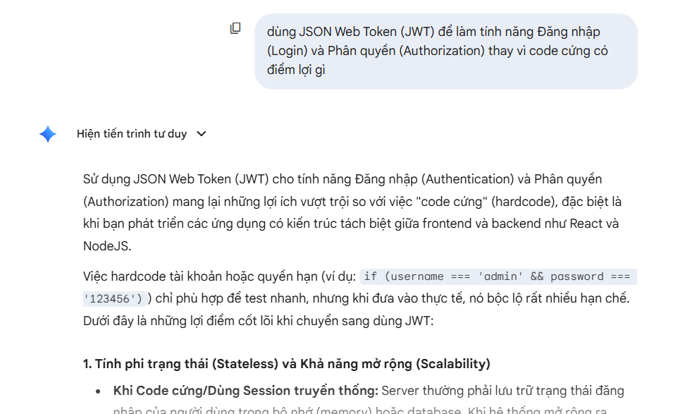
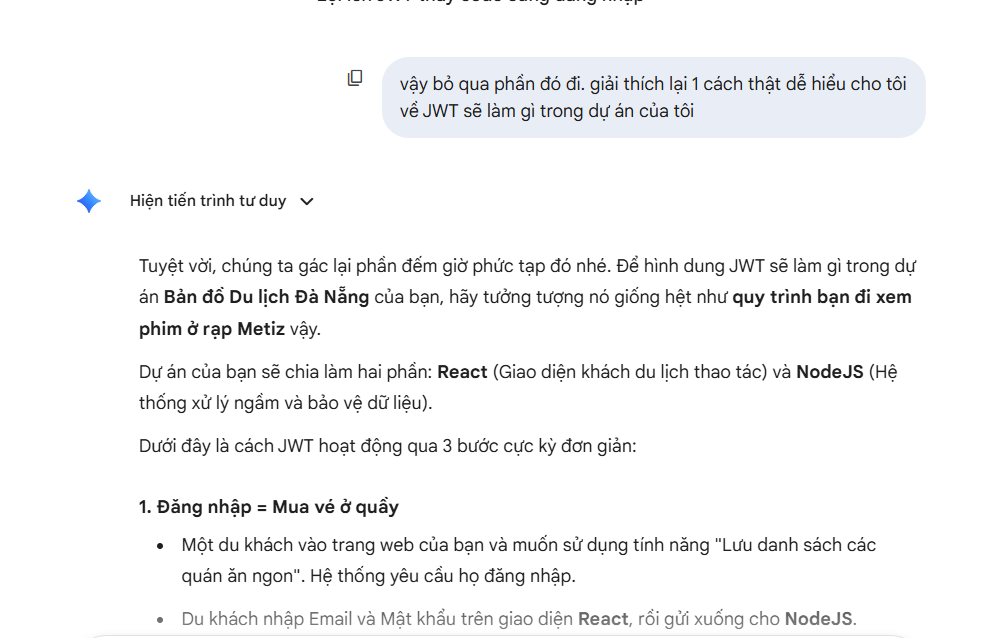
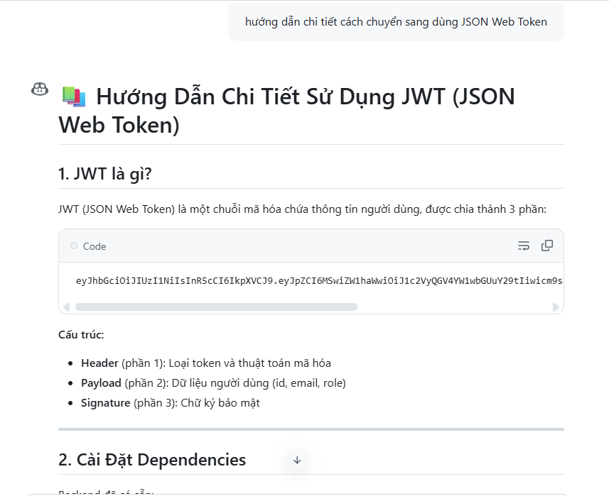
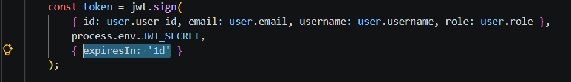
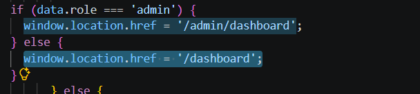
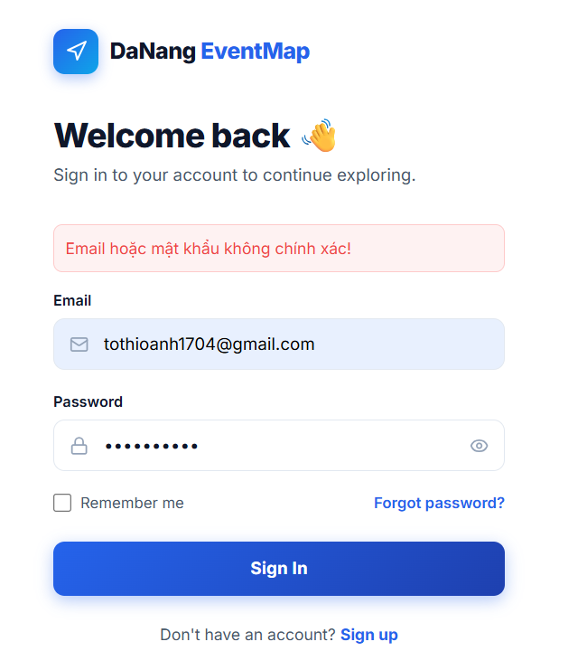

# AI Audit Log

## 1. Thông tin chung

| Thông tin | Nội dung |
|---|---|
| Môn học | Software Development Project |
| Mã môn học | SWP391 |
| Lớp | SE20A04 |
| Học kỳ | SU26 |
| Tên bài tập / Project | DN-Pulse: Intelligent Urban Routing System |
| Tên sinh viên | Tô Thị Oanh |
| MSSV | DE191103 |
| Giảng viên hướng dẫn | QuangLTN |
| Ngày bắt đầu | 11/05/2026 |
| Ngày hoàn thành |  |

---

## 2. Công cụ AI đã sử dụng

Đánh dấu các công cụ AI đã sử dụng trong quá trình thực hiện bài tập/project.

- [✓] ChatGPT
- [✓] Gemini
- [✓] Claude
- [✓] GitHub Copilot
- [ ] Cursor
- [✓] Antigravity
- [ ] Perplexity
- [ ] Microsoft Copilot
- [ ] Công cụ khác: ....................................

---

## 3. Mục tiêu sử dụng AI

- Phân tích rủi ro của cơ chế đăng nhập hardcoded.
- Tư vấn kiến trúc xác thực không lưu trạng thái sử dụng JWT.
- Thiết kế luồng phân quyền người dùng.

## 4. Nhật ký sử dụng AI chi tiết

> Mỗi lần sử dụng AI cho một phần quan trọng của bài tập/project, sinh viên cần ghi lại theo mẫu bên dưới.  
> Sinh viên/nhóm có thể nhân bản mẫu “Lần sử dụng AI” nhiều lần tùy theo số lần sử dụng AI thực tế.

---

### Lần sử dụng AI số 1

| Nội dung | Thông tin |
|---|---|
| Ngày sử dụng | 24/05/2026 |
| Công cụ AI |Gemini, GitHub Copilot|
| Mục đích sử dụng | Thiết kế stateless auth và luồng phân quyền Role-Based Access Control bằng JWT để thay thế cho hardcode |
| Phần việc liên quan | Design, Frontend, Backend|
| Mức độ sử dụng |Hỗ trợ một phần|

#### 4.1. Prompt đã sử dụng

I want to replace hardcoded admin credentials with JWT for Login and Authorization in my React/Node.js project. What are the benefits? Do I still need a database if I use JWT? Explain the flow simply and give me the code to implement this.

#### 4.2. Kết quả AI gợi ý

Tóm tắt nội dung AI đã trả lời hoặc gợi ý.

- Về kiến trúc: AI giải thích rằng JWT không thay thế Database (DB vẫn dùng để check user/pass), JWT có nhiệm vụ Authorization dựa theo mô hình Stateless.
- Về code: AI cung cấp code sign token bằng jsonwebtoken ở backend Node.js. Ở frontend, AI gợi ý lưu token này vào localStorage.

#### 4.3. Phần sinh viên/nhóm đã sử dụng từ AI

Mô tả rõ phần nào được sử dụng lại từ gợi ý của AI.

Sử dụng bộ khung do AI cung cấp: Dùng thư viện jsonwebtoken để tạo/giải mã token, áp dụng bcrypt để băm mật khẩu an toàn, dùng Axios Interceptor để tự động nhét token vào header của mỗi request.
#### 4.4. Phần sinh viên/nhóm tự chỉnh sửa hoặc cải tiến

Mô tả sinh viên/nhóm đã thay đổi, kiểm tra, sửa lỗi hoặc cải tiến gì so với gợi ý ban đầu của AI.
1. Rút ngắn thời hạn Token : 
  Trong code mẫu, token được set thời gian: 7 ngày. Thấy được cấu hình này rủi ro cao vì nếu token bị đánh cắp, hacker có thể sử dụng nó trong thời gian dài. Vì vậy, sửa lại thời gian của token là 1 ngày để đảm bảo an toàn .

  2. Xử lý lỗi giao diện không cập nhật đúng quyền : 
  Khi chuyển hướng người dùng sau khi đăng nhập, AI dùng hook useNavigate('/dashboard') của React. Khi test thử thì có lỗi: trang không được làm mới hoàn toàn khiến thanh Navbar đôi khi bị kẹt ở trạng thái cũ. Quyết định đổi sang dùng `window.location.href` (file `Login.tsx`). Để ép trình duyệt tải lại trang 100%, giúp hệ thống cập nhật đúng và ngay lập tức quyền của Admin/User.

  3. Tối ưu trải nghiệm người dùng - UI/UX : 
  AI chỉ cho logic đăng nhập cơ bản nhưng bỏ qua độ trễ mạng thực tế. Bổ sung thêm state loading và errorMsg để quản lý giao diện. Khi submit, nút Đăng nhập sẽ tự động bị vô hiệu hóa để chặn spam request. Nếu đăng nhập thất bại, hệ thống cũng sẽ báo câu lỗi trực tiếp trên màn hình thay vì giao diện bị đơ không phản hồi.


#### 4.5. Minh chứng

Đây là các hình ảnh từ source code thực tế của dự án, minh chứng cho các quyết định điều chỉnh và tối ưu hóa:

**1. Minh chứng lịch sử trò chuyện và lấy code khung (Boilerplate) từ AI**



*Ảnh chụp màn hình cho thấy việc đặt prompt yêu cầu AI giải thích sự khác biệt giữa JWT và Database, đồng thời xin code mẫu.*



*AI đính chính lại kiến trúc (JWT không thay thế Database mà hoạt động song song) và bắt đầu cung cấp code cấu hình Backend.*



*Phần code Frontend (Axios Interceptor và React Router) do AI gen ra để nhóm sử dụng làm bộ khung nền tảng.*

2. Minh chứng siết chặt bảo mật Token (Tệp `server.js`)**



* Code gốc AI để thời gian token là 7 ngày. Đã rút ngắn thời gian từ 7 ngày xuống còn 1 ngày để giảm thiểu rủi ro bảo mật.*

**3. Minh chứng xử lý lỗi điều hướng giao diện (Tệp `Login.tsx`)**



*Bỏ code useNavigate của AI vì bị lỗi kẹt Navbar, thay thế bằng `window.location.href` để ép trình duyệt làm mới trang 100%, khắc phục triệt để lỗi kẹt trạng thái Navbar.*

**4. Minh chứng tối ưu trải nghiệm người dùng UI/UX (Tệp `Login.tsx`)**



*Code AI không xử lý lúc mạng lag, viết thêm state loading để khóa nút chống spam, và errorMsg để báo lỗi trực tiếp ra màn hình cho dễ nhìn.*

#### 4.6. Nhận xét cá nhân/nhóm

Sinh viên/nhóm học được gì sau lần sử dụng AI này?

```text
Viết tại đây...
```

---

### Lần sử dụng AI số 2

| Nội dung | Thông tin |
|---|---|
| Ngày sử dụng |  |
| Công cụ AI | ChatGPT / Gemini / Claude / GitHub Copilot / Cursor / Antigravity / Khác |
| Mục đích sử dụng |  |
| Phần việc liên quan | Requirement / Design / Database / Frontend / Backend / Testing / Debug / Report / Presentation / Other |
| Mức độ sử dụng | Hỗ trợ ý tưởng / Hỗ trợ một phần / Hỗ trợ nhiều / Sinh chính nội dung |

#### 4.1. Prompt đã sử dụng

```text
Dán nguyên văn prompt đã hỏi AI tại đây.
```

#### 4.2. Kết quả AI gợi ý

```text
Viết tại đây...
```

#### 4.3. Phần sinh viên/nhóm đã sử dụng từ AI

```text
Viết tại đây...
```

#### 4.4. Phần sinh viên/nhóm tự chỉnh sửa hoặc cải tiến

```text
Viết tại đây...
```

#### 4.5. Minh chứng

| Loại minh chứng | Nội dung |
|---|---|
| Link commit |  |
| File liên quan |  |
| Screenshot |  |
| Kết quả chạy/test |  |
| Link video demo |  |
| Ghi chú khác |  |

#### 4.6. Nhận xét cá nhân/nhóm

```text
Viết tại đây...
```

---

### Lần sử dụng AI số 3

| Nội dung | Thông tin |
|---|---|
| Ngày sử dụng |  |
| Công cụ AI | ChatGPT / Gemini / Claude / GitHub Copilot / Cursor / Antigravity / Khác |
| Mục đích sử dụng |  |
| Phần việc liên quan | Requirement / Design / Database / Frontend / Backend / Testing / Debug / Report / Presentation / Other |
| Mức độ sử dụng | Hỗ trợ ý tưởng / Hỗ trợ một phần / Hỗ trợ nhiều / Sinh chính nội dung |

#### 4.1. Prompt đã sử dụng

```text
Dán nguyên văn prompt đã hỏi AI tại đây.
```

#### 4.2. Kết quả AI gợi ý

```text
Viết tại đây...
```

#### 4.3. Phần sinh viên/nhóm đã sử dụng từ AI

```text
Viết tại đây...
```

#### 4.4. Phần sinh viên/nhóm tự chỉnh sửa hoặc cải tiến

```text
Viết tại đây...
```

#### 4.5. Minh chứng

| Loại minh chứng | Nội dung |
|---|---|
| Link commit |  |
| File liên quan |  |
| Screenshot |  |
| Kết quả chạy/test |  |
| Link video demo |  |
| Ghi chú khác |  |

#### 4.6. Nhận xét cá nhân/nhóm

```text
Viết tại đây...
```

---

## 5. Bảng tổng hợp mức độ sử dụng AI

Đánh dấu mức độ AI hỗ trợ ở từng hạng mục.

| Hạng mục | Không dùng AI | AI hỗ trợ ít | AI hỗ trợ nhiều | AI sinh chính | Ghi chú |
|---|:---:|:---:|:---:|:---:|---|
| Phân tích yêu cầu |  |  |  |  |  |
| Viết user story/use case |  |  |  |  |  |
| Thiết kế database |  |  |  |  |  |
| Thiết kế kiến trúc hệ thống |  |  |  |  |  |
| Thiết kế giao diện |  |  |  |  |  |
| Code frontend |  |  |  |  |  |
| Code backend |  |  |  |  |  |
| Debug lỗi |  |  |  |  |  |
| Viết test case |  |  |  |  |  |
| Kiểm thử sản phẩm |  |  |  |  |  |
| Tối ưu code |  |  |  |  |  |
| Viết báo cáo |  |  |  |  |  |
| Làm slide thuyết trình |  |  |  |  |  |

---

## 6. Các lỗi hoặc hạn chế từ AI

Ghi lại các trường hợp AI trả lời sai, thiếu, chưa phù hợp hoặc sinh code không chạy.

| STT | Lỗi/hạn chế từ AI | Cách phát hiện | Cách xử lý/cải tiến |
|---:|---|---|---|
| 1 |  |  |  |
| 2 |  |  |  |
| 3 |  |  |  |

---

## 7. Kiểm chứng kết quả AI

Mô tả cách sinh viên/nhóm kiểm tra lại kết quả do AI gợi ý.

Có thể bao gồm:

- Chạy thử chương trình
- Viết test case
- So sánh với yêu cầu đề bài
- Kiểm tra output
- Đối chiếu tài liệu môn học
- Hỏi lại giảng viên
- Review cùng thành viên nhóm
- Kiểm tra lỗi bảo mật
- Kiểm tra bằng dữ liệu mẫu
- So sánh trước và sau khi dùng AI

### Nội dung kiểm chứng

```text
Viết tại đây...
```

---

## 8. Đóng góp cá nhân hoặc đóng góp nhóm

### 8.1. Đối với bài cá nhân

Mô tả phần sinh viên tự làm, phần AI hỗ trợ và phần đã tự cải tiến.

```text
Viết tại đây...
```

### 8.2. Đối với bài nhóm

| Thành viên | MSSV | Nhiệm vụ chính | Có sử dụng AI không? | Minh chứng đóng góp |
|---|---|---|---|---|
|  |  |  | Có / Không |  |
|  |  |  | Có / Không |  |
|  |  |  | Có / Không |  |
|  |  |  | Có / Không |  |

---

## 9. Reflection cuối bài

### 9.1. AI đã hỗ trợ em/nhóm ở điểm nào?

```text
Viết tại đây...
```

### 9.2. Phần nào em/nhóm không sử dụng theo gợi ý của AI? Vì sao?

```text
Viết tại đây...
```

### 9.3. Em/nhóm đã kiểm tra tính đúng đắn của kết quả AI như thế nào?

```text
Viết tại đây...
```

### 9.4. Nếu không có AI, phần nào sẽ khó khăn nhất?

```text
Viết tại đây...
```

### 9.5. Sau bài tập/project này, em/nhóm học được gì về môn học?

```text
Viết tại đây...
```

### 9.6. Sau bài tập/project này, em/nhóm học được gì về cách sử dụng AI có trách nhiệm?

```text
Viết tại đây...
```

---

## 10. Cam kết học thuật

Sinh viên/nhóm cam kết rằng:

- Nội dung AI hỗ trợ đã được ghi nhận trung thực.
- Không nộp nguyên văn kết quả AI mà không kiểm tra.
- Có khả năng giải thích các phần đã nộp.
- Chịu trách nhiệm về tính đúng đắn của sản phẩm cuối cùng.
- Hiểu rằng việc sử dụng AI không khai báo có thể ảnh hưởng đến kết quả đánh giá.

| Đại diện sinh viên/nhóm | Ngày xác nhận |
|---|---|
|  |  |
