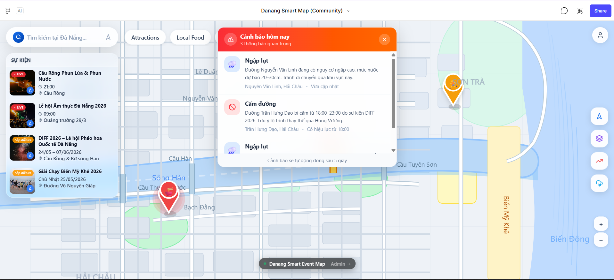
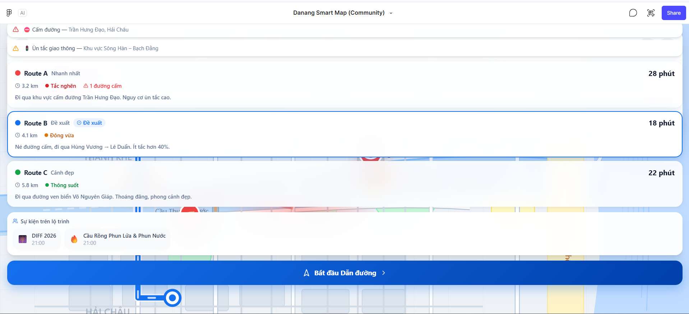
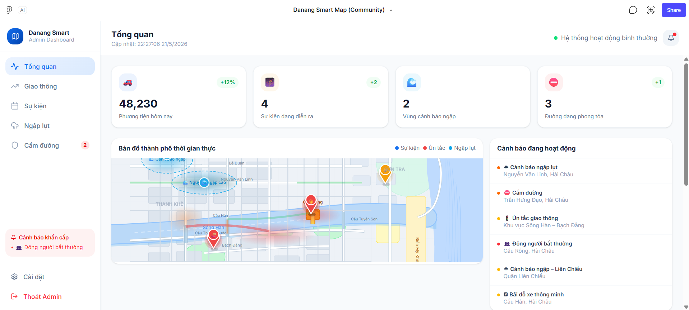

*Thiết Kế Giao Diện & Trải Nghiệm Người Dùng (UI/UX)*

I. Bản thiết kế Figma:
[Truy cập Figma - Danang Smart Map & Community](https://www.figma.com/make/3BX34kep9G1MNmxhVWSF2f/Danang-Smart-Map--Community-?t=oQYBXKz5Gms6D35B-1)

II. Các màn hình cốt lõi (Core Screens)

1. Màn hình Bản đồ, Sự kiện & Cảnh báo (Home & Alerts View)
   
 
- Giao diện bao gồm 3 thông tin trên cùng một màn hình:

  - Panel bên trái: Danh sách sự kiện giúp người dùng nắm bắt nhanh tình hình thành phố.

  - Popup trung tâm: Cảnh báo giao thông thời gian thực (Chỉ xuất hiện 5s đầu sau đó biến mất).

  - Bản đồ: Hiển thị trực quan vị trí sự kiện và các vùng cảnh báo.

2. Màn hình Đề xuất Lộ trình thông minh (Route Selection)
   

- Khi người dùng cần di chuyển, hệ thống cung cấp 3 lựa chọn thay vì chỉ một đường duy nhất:

  - Route A (Nhanh nhất): Cảnh báo có đường cấm hoặc ùn tắc cao.

  - Route B (Đề xuất): Tự động né các tuyến đường cấm do sự kiện, đưa ra lộ trình tối ưu nhất.

  - Route C (Cảnh đẹp): Ưu tiên các tuyến đường ven biển, thoáng đãng dành cho khách du lịch.

3. Màn hình Điều hướng (Turn-by-turn Navigation)
   

- Giao diện chỉ đường thực tế tập trung vào sự an toàn và hạn chế phân tâm:

  - Thanh Header (Top): Tthông báo hướng rẽ tiếp theo.

  - Lộ trình bản đồ: Hiển thị rõ vị trí kẹt xe hoặc sự cố phía trước.

  - Panel bên dưới: Hiển thị thời gian, khoảng cách và thao tác dừng/tính lại lộ trình.

4. Màn hình Quản trị viên (Admin Dashboard)
   
   
- Đây là trung tâm điều khiển dành cho Admin quản lý dữ liệu toàn thành phố:

  - Thống kê tổng quan: Sự kiện đang diễn ra, vùng ngập lụt, đường phong tỏa.

  - Bản đồ thời gian thực: Giúp Admin có cái nhìn toàn cảnh.
  - Quản lý cảnh báo: Danh sách các cảnh báo khẩn cấp đang hoạt động .
